+++
author = "Jinsoo Youn"
title = "10장 - statefulSet"
date = "2022-08-03"
description = "파드의 상태를 저장하는 statefulset"
tags = [
"kubernetes",
"study",
]
categories = [
"kubernetes",
"study",
]
series = ["Kubernetes-In-Action"]
aliases = ["Kubernetes-In-Action"]
image = "cover.png"
+++

파드의 상태를 저장하는 statefulSet을 알아보자. stateful이란 무엇인가
<!--more-->

- Stateful Applications

  상태 저장, 유지

  Database, 데이터를 저장하는 applications


- PersistentVolume (PV), PersistentVolumeClaim (PVC)
    - 클러스터의 스토리지를 추상화하여 접근하는 방법
    - node가 클러스터 리소스인것 처럼, PV는 클러스터 리소스이다.
    - PVC는 스토리지에 대한 요청이다.
    - Pod는 node 리소스를 사용하고, PVC는 PV 리소스를 사용한다.

- Headless Service
    - ClusterIP=None 으로 설정
    - Pod를 묶어주지만, entry point를 생성하지는 않는다.
    - Service와 연결된 pod의 endpoint로 DNS 레코드가 생성된다.
    - Pod의 DNS 주소로 각 pod에 접근 가능.
        - pod-ip-addr.default.pod.cluster.local
        - podname.svcname.default.svc

# Stateful Pod 복제

- Pod 개별의 state를 저장할 수 있는 volume 필요.


- ReplicaSet의 복제본은 이름과 IP 주소만 다를 뿐, 나머지는 똑같다.
- ReplicaSet의 모든 복제본은 동일은 PersistentVolumeClaim을 사용한다.
- ReplicaSet, DemonSet, Job은 stateless application을 관리하기 위해 사용된다.

### 각 pod가 분리된 저장소를 갖도록 여러 복제본 실행

- pod instance 마다 하나의 ReplicaSet 사용

  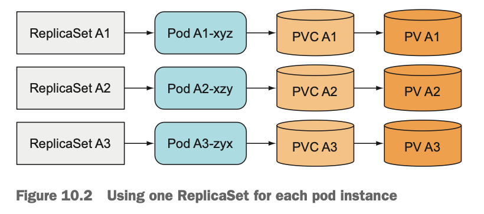

    - 단일 ReplicaSet보다 훨씬 번거롭다. pod를 확장하려면 ReplicaSet을 더 만들어야 한다.

- 같은 볼륨에서 여러 개의 디렉터리 사용
    - 모든 pod가 같은 PersistentVolume을 사용하지만 각 pod의 볼륨 안에 별도의 파일 디렉터리를 갖게 한다.

      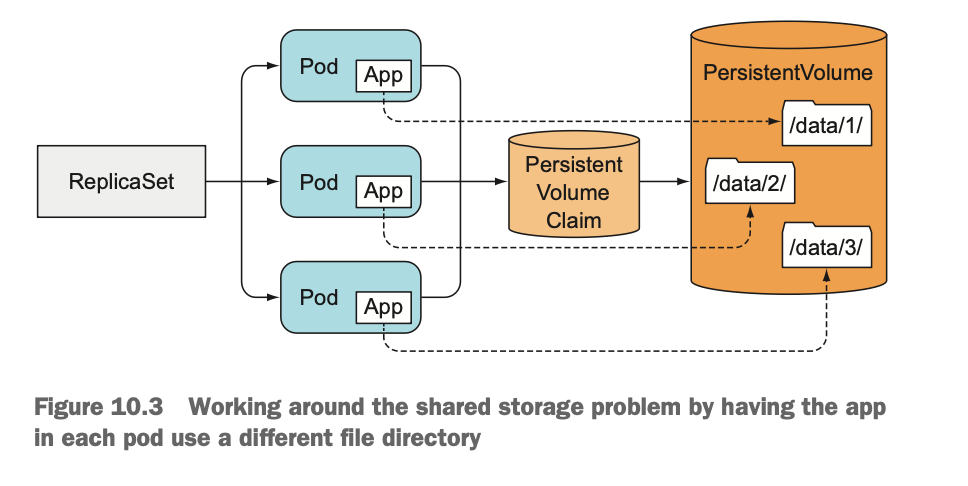

    - 각 pod에게 서로 다른 directory를 사용하도록 구성할 수 없다. (단일 template으로 pod를 복제하기 때문)
    - 공유 스토리지 볼륨에 병목 현상이 발생한다.

### 각 pod에 안정적인 ID 제공

- 분산형 stateful applicatoin에서는 안정적인 네트워크 ID를 요구하는 것이 일반적이다.
- 특정 앱은 application cluster 내의 다른 pod 목록과 각각의 IP 주소를 관리하는 관리자가 필요하다.
- 그러나 pod는 스케줄될 때마다 새로운 호스트 이름과 IP 주소를 얻게 된다.

# StatefulSet 이해

- StatefuleSet과 ReplicaSet 비교
    - Stateless application의 instance (ReplicaSet의 pod)는 개별적으로 관리하지 않는다. 인스턴스가 소멸되더라도 문제가 되지 않는다. 새 인스턴스를 만들 수 있고, 차이가 없다.
    - Satateful application의 instance (StatefulSet의 pod)는 개별적으로 관리되며, 인스턴스가 소멸된 후 새로 만들어지면, 이전 인스턴스와 상태 및 ID가 완전히 같아야 한다.

### 안정적인 네트워크 ID 제공

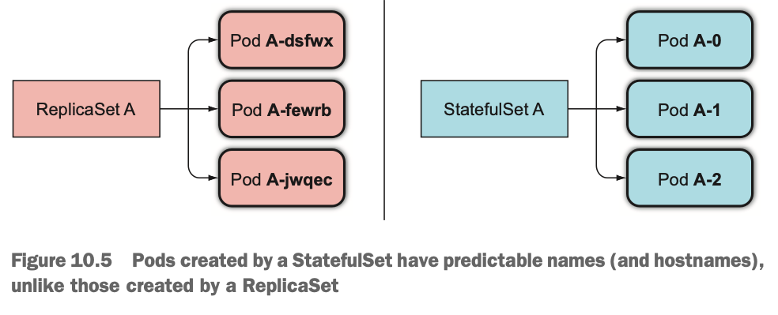

- StatefulSet에 의해 생성된 pod에는 서수형 색인이 할당된다.
- 이를 통해 pod에 안정적인 스토리지를 붙일 수 있다.

- 관리 Service
    - Stateful pod는 host 이름에 주소를 지정해야 한다.
    - Stateful의 경우, pod들이 서로 다른 상태를 유지하는 등 서로 다르기 때문에 특정 pod를 지정하고자 한다.
    - 이러한 이유로 StatefulSet 에서는 각 pod에 실제 네트워크 ID를 제공한다.
    - 이를 위해 관리용 ‣ 를 만들어야 한다. 각 pod는 이 service를 통해 고유한 DNS 항목을 얻는다. (ex. pod의 이름이 A-0 인 경우, a-0.foo.default.svc.cluster.local 를 통해 pod에 연결할 수 있다.

- 소멸된 pod 교체

  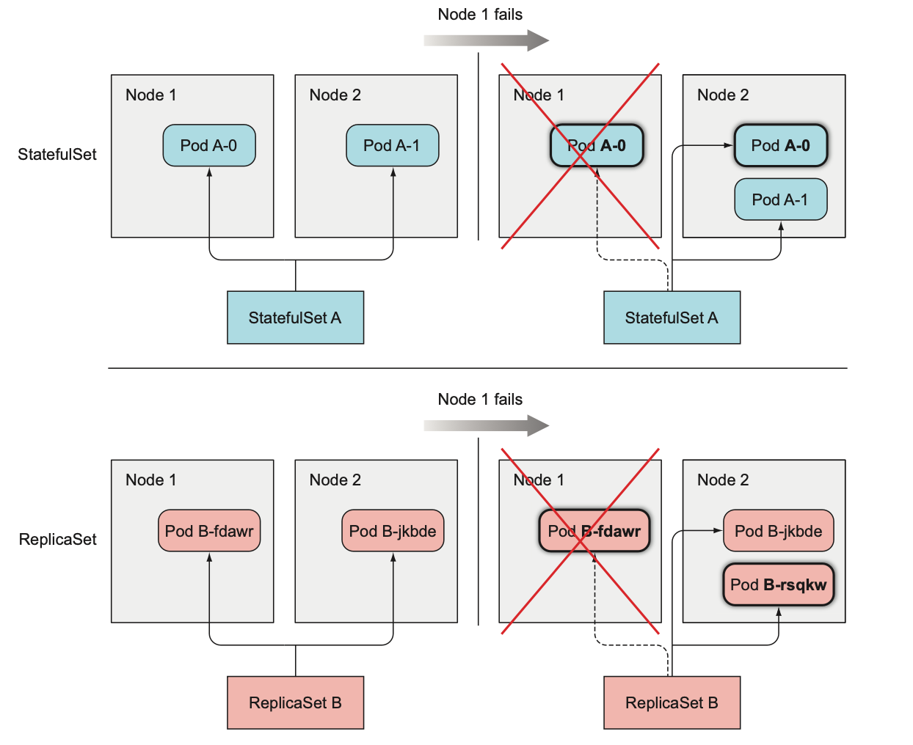

    - StatefulSet에 의해 관리되는 pod instance가 사라지면, 새 instance로 교체한다.
    - 이는 ReplicaSet과 동일하지만, 대체 pod는 소멸된 pod와 동일한 이름 및 호스트 이름을 갖는다.
    - 동일한 node로 스케줄 될 필요는 없다.

- StatefulSet 스케일링

  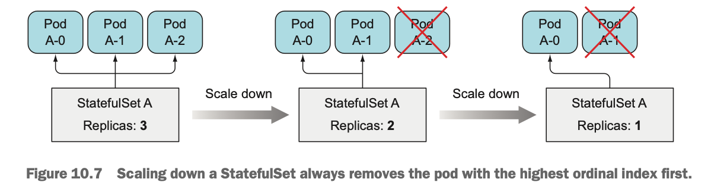

    - StatefulSet의 스케일링은 예측 가능하다.
    - 새 pod 생성시 사용되지 않은 다음 서수 인덱스를 사용한다.
    - pod 제거시 항상 가장 높은 서수 인덱스의 instance가 제거된다.

### 각 stateful instance에 안정적인 전용 스토리지 제공

- StatefulSet이 pod의 ID를 안정적으로 유지하는 것을 살펴봤다.
- Storage는 어떨까?
- Stateful Pod 마다 자체 스토리지를 사용해야 하며, pod를 다시 스케줄한 경우 동일한 스토리지가 연결돼 있어야 한다.
- Stateful Pod의 스토리지는 다른 pod와 분리되고 유지되어야 한다.

- VolumeClaim 템플릿을 갖춘 pod templates

  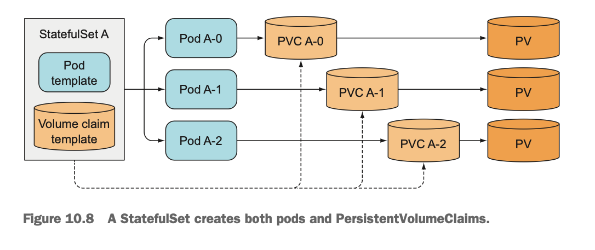

    - Pod를 생성하는 것과 동일한 방법으로 PersistentVolumeClaim을 생성한다.

- PersistnetVolumClaim의 생성과 삭제
    - StatefulSet을 스케일업하면 pod와 PersistnetVolumeClaim이 생성된다.
    - 하지만, 스케일다운을 하면 pod는 삭제하고 claim은 남겨둔다. 클레임을 삭제하면 PersistentVolume이 재사용되거나 삭제되고 해당 내용이 손실되기 때문이다.
    - PersistnetVolumeClaim을 수동으로 삭제해야 한다.

- 같은 pod의 새 instance에 PersistnetVolumeClaim 다시 붙이기

  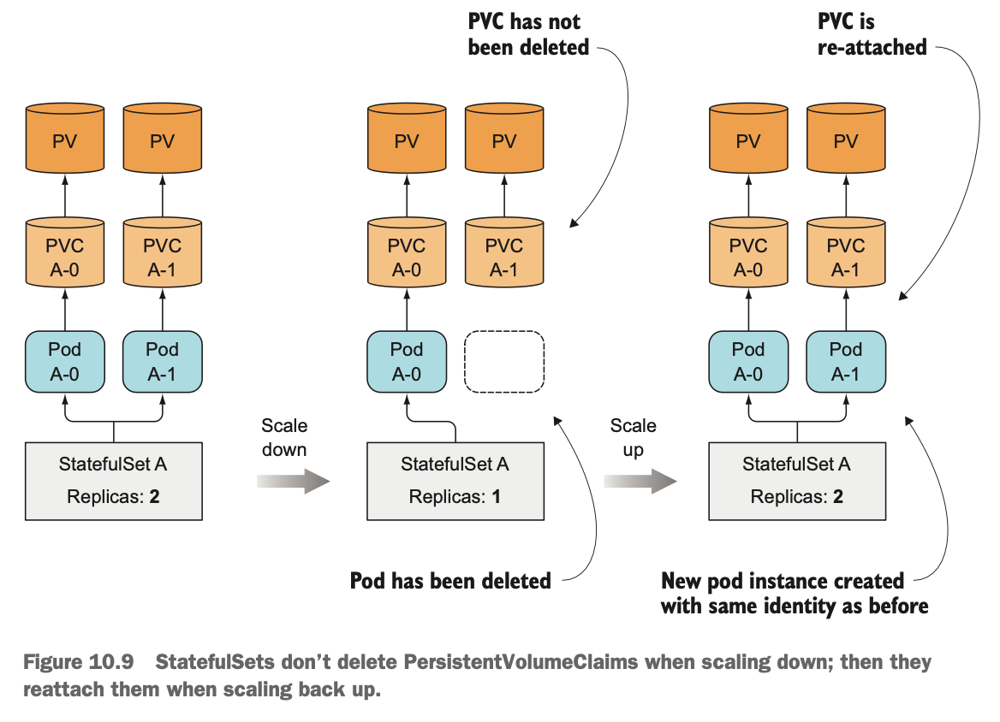

    - 실수로 statefulset을 스케일다운했다면 다시 스케일업해 실수를 되돌릴 수 있고, 새 pod는 동일한 이름은 물론 동일한 지속된 상태를 다시 가져오게 된다.


### StatefuleSet의 보장

- StatefulSet에서 동일한 ID를 가진 두 개의 instance가 실행되면 안된다.
- StatefulSet은 stateful pod instance의 유일성을 보장해야 한다.

# StatefulSet 사용

- 관리 Service 생성

    ```yaml
    apiVersion: v1
    kind: Service
    metadata:
      name: kubia # Service 이름
    spec:
      clusterIP: None # Headless Service
      selector:
        app: kubia # app=kubia label을 갖는 pod는 이 service에 속한다.
      ports:
      - name: http
        port: 80
    ```


- StatefulSet YAML

    ```yaml
    apiVersion: apps/v1
    kind: StatefulSet
    metadata:
      name: kubia
    spec:
      selector:
        matchLabels:
          app: kubia
      serviceName: kubia
      replicas: 2
      template:
        metadata:
          labels:
            app: kubia # StatefuSet에 의해서 생성된 pod는 app=kubia 라벨을 갖는다.
        spec:
          containers:
          - name: kubia
            image: luksa/kubia-pet
            ports:
            - name: http
              containerPort: 8080
            volumeMounts:
            - name: data
              mountPath: /var/data # pod 내부 컨테이너는 이 경로에 pvc 볼륨을 마운트한다.
      volumeClaimTemplates: # PersistentVolumeClaim이 생성된다.
      - metadata:
          name: data
        spec:
          resources:
            requests:
              storage: 1Mi
          accessModes:
          - ReadWriteOnce
    ```

  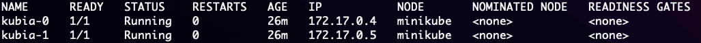

    - StatefulSet 확인

        ```bash
        kubectl get pod kubia-0 -o yaml
        ```

        - spec:containers:volumeMounts 확인

          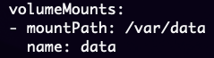

        - spec:volumes 확인

          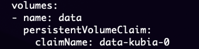


    - 생성된 PersistentVolumeClaim 확인
        
        ```bash
        kubectl get pvc
        ```
        
        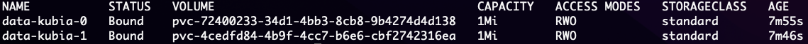


- Pod 동작해보기
    - test pod에서 요청 보내기

        ```bash
        curl 172-17-0-4.default.pod:8080
        # or
        curl kubia-0.kubia.default.svc:8080
        ```

    - POST 요청 보내기

        ```bash
        curl -d "Hello kubia-0" -X POST kubia-0.kubia.default.svc:8080
        ```

    - GET 요청으로 저장된 데이터 확인

        ```bash
        curl kubia-0.kubia.default.svc:8080
        ```

    - State가 지속되는지 확인
        - Pod 삭제 후 GET 요청으로 확인

            ```bash
            kubectl delete pod kubia-0
            ```

    - 일반적인 non-headless service를 통해 stateful pod 노출하기
        - ClusterIP Service 생성

            ```yaml
            apiVersion: v1
            kind: Service
            metadata:
              name: kubia-public
            spec:
              selector:
                app: kubia
              ports:
              - port: 80
                targetPort: 8080
            ```

        - curl을 통해 요청을 보낼 수 있으며, 요청은 임의의 pod로 연결된다.

    - StatefulSet 업데이트

        ```bash
        kubectl edit statefulset kubia
        ```

      image를 수정하면 롤링업데이트 수행. (deployment와 유사)


# StatefulSet에서 피어 발견

- StatefulSet의 멤버는 다른 멤버를 쉽게 찾을 수 있어야 한다.
- API 서버를 통해 알아낼 수도 있지만, 쿠버네티스의 목표 중 하나는 완전히 쿠버네티스와 상관 없는 애플리케이션을 유지할 수 있게 기능을 노출하는 것이다.
- DNS를 통한 피어 검색

  

    - [SRV 레코드](https://www.joinc.co.kr/w/man/12/srv)는 특정 서비스를 제공하는 서버의 호스트 이름 및 포트를 가리키는 데 사용된다.
    - 쿠버네티스는 headless service 를 지원하는 pod의 호스트 이름을 가리키도록 SRV 레코드를 만든다.
    - SRV lookup을 통해 peer를 찾을 수 있다. [kubernetes.io](https://kubernetes.io/docs/tutorials/stateful-application/basic-stateful-set/)
    - 클러스터된 데이터 스토리지 사용 가능

# StatefulSet이 node 장애를 처리하는 방법

- StatefulSet은 동일한 ID와 스토리지로 실행하는 두 개의 pod가 없다는 것을 보장한다. (‣)
- 따라서 node가 실패하더라도 StatefulSet은 pod를 더이상 실행하지 않는다는 것을 확신할 때까지 대체 pod를 생성할 수 없으며 생성해서도 안된다.

- node 네트워크 연결 해제 시뮬레이션
    - node → NotReady
    - 해당 node에서 실행중인 pod는 Unknown 상태가 된다.
    - pod가 몇 분 이상 알 수 없는 상태로 유지하면 (이 시간은 변경 가능) pod는 node에서 자동으로 제거된다.
    - 이는 master node (control plane)에 의해서 수행하며, 삭제될 pod가 있는 node의 kubelet이 pod 삭제 표시를 확인하여 pod를 종료한다.
    - 하지만, node가 연결 해제 되었으므로 pod를 종료할 수 없다. (계속 unknown 상태 유지)

- 수동으로 pod 삭제
    - 일반적인 방법으로 pod를 지우면, 지워지지 않는다.
    - 해당 node의 kubelet이 pod의 컨테이너가 종료됐음을 API 서버에 알리는 즉시 제거되는데, node의 네트워크가 다운됐으므로 이 작업을 수행할 수 없다.

- Pod의 강제 삭제
    - Pod가 더이상 실행되지 않고 있음을 확인하기까지 기다리지 않고, API 서버가 pod를 삭제하도록 할 수 있다.

    ```bash
    kubectl delete pod kubia-0 --force --grace-period 0
    ```

    - 위 명령어로 pod가 강제로 삭제되고, 새로운 kubia-0 pod가 정상 작동하는 node에 생성된다.