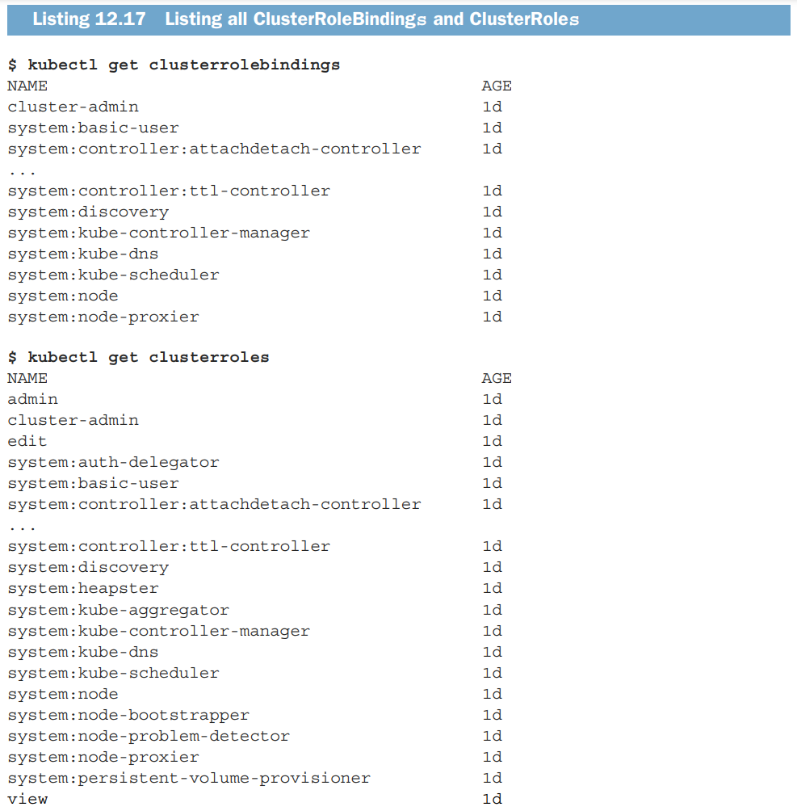

+++
author = "Jinsoo Youn"
title = "12장 - Authentication & Authorization"
date = "2022-08-05"
description = "쿠버네티스의 인증과 인가"
tags = [
"kubernetes",
"study",
]
categories = [
"kubernetes",
"study",
]
series = ["Kubernetes-In-Action"]
aliases = ["Kubernetes-In-Action"]
image = "cover.png"
+++

쿠버네티스의 인증과 인가 방식에 대해 알아보자
<!--more-->


인증 인가 / CRD

우리가 kubernetes apiserver를 사용할 때는 언제나 어떤 신원과 권한을 가지고서 사용하게 된다.

- hypercloud console에서 뭐 요청 보낼 때 - 로그인한 사용자의 권한 or console의 권한
- pod에서 뭐 요청 보낼 때 - pod의 권한
- kubectl로 명령어 날릴 때 - kube config 파일에 들어있는 권한

이제 이것들에 대해서 살펴볼 차례다.

pod가 api server에 뭔가를 요청하는 경우 - 내장된 service account token을 사용해 인증을 한다.

Service Account Token의 Payload 예시

```json
{
  "kubernetes.io/serviceaccount/namespace": "api-gateway-system",
  "kubernetes.io/serviceaccount/secret.name": "api-gateway-token-2sb7b",
  "kubernetes.io/serviceaccount/service-account.name": "api-gateway",
  "kubernetes.io/serviceaccount/service-account.uid": "6351c10c-0903-4c69-ad58-2dc620430d2d",
  "sub": "system:serviceaccount:api-gateway-system:api-gateway"
}
```

sub (subject) 가 name 같은 역할을 한다.


- 각 파드는 정확히 1개의 service account를 가진다.
- 각 파드는 자기가 속한 네임스페이스의 service account만 사용할 수 있다.
- 같은 service account가 여러 파드에서 쓰일 수 있다.


service account는 yaml 없이 간단한 명령어로도 만들 수 있다.

이렇게 생성된 sa를 describe해보고 secrets, tokens에 주목해보자.

원래는 pod가 아무 secret이나 mount할 수 있지만, Mountable secret에 있는 것만 mount하도록 (SA를 통해) 설정할 수 있다. 이 때 사용되는 것이 [`kubernetes.io/enforce-mountable-secrets="true"`](http://kubernetes.io/enforce-mountable-secrets=%22true%22) annotation이다.


image pull secret을 sa에 등록해줄 수도 있다.

(default가 아닌) sa를 pod에 mount하고 싶으면 다음과 같이 설정한다.


인증이 되고 나면 인가를 해야겠지?

Role-based access control (RBAC) 이 기본값이고, 표준이고, 많이 사용된다.

다른 것도 있다. Attribute-based access control (ABAC) plugin, WebHook plugin, custom plugin implementations 등…

action의 종류


role로 권한을 정의하고 role binding으로 권한을 부여한다.


rolebinding이 role을 부여하는 대상은 user / group / service account 이다.

(다 대 다 mapping의 연결 테이블이 떠오른다…)


하지만 User는 k8s의 기본 리소스가 아니어서, user를 사용하고자 한다면 외부 ID provider가 필요하다. 우리처럼 OIDC를 사용하는 경우, token에 들어있는 정보와 apiserver의 설정을 잠깐 살펴보자.


ID token 안에 신원 정보(sub가 기본값이지만 위 설정에서는 oidc-username-claim을 통해 preferred_username을 사용하도록 해놓았다.), group 정보(oidc-groups-claim을 통해 groups를 사용하도록 해놓았다. 이 설정은 optional이고 따라서 기본값이 없다.)가 들어있다.

시스템에 예약된 Group들도 있다.


한놈이 여러 role을 부여받을 수도 있다. 블랙리스트가 아니라 화이트리스트 같은 거다.

그러면 그놈의 권한은 부여받은 모든 권한의 합집합이 될 것이다.

role과 rolebinding은 그 자체가 namespaced resource이다.

자기 ns 하위의 리소스에 대해서만 유효하다.

cluster role과 cluster role binding도 있다.

cluster resource를 다루고자 한다면 cr, crb를 써야 하고, 얘네도 그 자체로 cluster resource가 된다.

(cluster resource에는 node, persistent volume, namespace 같은 것이 있다.)


파드에서 어떤 요청을 날렸는데, 파드(가 사용하는 sa)에 그 권한이 없다면?


role의 명세가 어떻게 생겼는지 보자.


보통은 위와 같지만, resourceNames 필드를 사용하면 ‘특정 리소스타입 전체’가 아니라 ‘특정한 리소스 인스턴스 한 놈’에 대한 권한도 부여할 수 있다.


role binding은 ns를 가진다고 했는데, 자기 ns에 속하는 role만 남에게 부여할 수 있다.

생각해보면 당연한 거다. 남의 ns에서 role을 막 훔쳐올 수 있으면 개판이 될테니…

간단한 role은 yaml 없이도 만들 수 있다.
```shell
kubectl create role service-reader --verb=get --verb=list --resource=services -n bar
```

간단한 rolebinding도 마찬가지로 yaml 없이 만들 수 있다.
```shell
kubectl create rolebinding test --role=service-reader --serviceaccount=foo:default -n foo
```


만들어진 놈의 명세는 이렇다.


role은 1개지만 subject는 여럿일 수 있음에 유의하자.

rolebinding으로 남의 role을 빼앗아 올 수는 없다고 했는데, 우리 role을 남한테 주는 건 가능하다. 아래를 보자.


위에서 잠깐  cluster role, cluster role binding을 언급했는데, 이제 좀 살펴보자.

role, rb로는 못하고 cr, crb로 할 수 있는 것들은 이렇다.

- cluster resource(node, pv, ns 등)에 대한 권한을 정의하고 부여하는 것
- 비-리소스 API (apiserver의 /healthz 등)에 대한 권한을 정의하고 부여하는 것
- 모든 ns의 리소스들에 대한 권한을 일괄적으로 정의하고 부여하는 것

위와 같은 순서로 살펴볼 것이다.

간단한 명령어로 cr을 생성한 다음 yaml 명세를 살펴보자.

```shell
kubectl create clusterrole pv-reader \
  --verb=get,list --resource=persistentvolumes
```


이제 이 cluster role을 rolebinding으로 나눠줘 보자.

(안될거다. crb 써야하는데 rb를 썼으니…)


cluster resource에 대한 cluster role은 cluster role binding으로 부여해주어야 한다.

crb 생성도 rb 생성과 비슷하게 할 수 있다.


다음으로 비-리소스 API에 대한 권한을 정의하고 부여하는 예시를 보자.


비-리소스 URL에 대해서는 create, update 같은 verb 대신에 plain HTTP verb (post, put, patch) 를 써야 하고, 소문자로 써야 한다.

이제 crb로 위 cr을 부여해보자.


모두에게 평등하게 권한을 부여한 예시다.

이제 cr을 통해 여러 ns의 권한을 일괄적으로 정의하는 예시를 보자.


위에 나열된 리소스들은 cluster resource가 아니고 namespaced resource임에 유의하자.

이러한 cluster role은 cluster role binding으로도 부여할 수 있고, role binding으로도 부여할 수 있다.

crb로 위 cr을 부여한 경우를 보자.


자기 ns, 남의 ns, all ns 에 대해서 전부 권한을 가지게 되었다는 것을 알 수 있다.


crb가 아닌 rb를 사용하는 경우를 보자.


rb를 사용한 경우에는, cr에 namespace 제약을 거는 효과가 있다.


지금까지 살펴본 케이스들을 표로 요약하면 이렇다.


시스템에 예약된 cr과 crb들도 있다.



view, edit, admin, cluster-admin 이렇게 4개는 특히 중요하다.

- view
    - 특정 ns에 대한 읽기 전용 권한을 부여하기 위해 사용한다.
    - Roles, RoleBindings, and Secrets에 대한 권한은 포함되지 않는다.
      (role escalation을 방지하기 위함)
- edit
    - 특정 ns에 대한 수정 권한을 부여하기 위해 사용된다.
    - Secret에 대한 읽기와 수정 권한을 포함한다.
    - role과 role binding에 대한 읽기와 수정 권한은 포함하지 않는다.
- admin
    - 특정 namespace에 대한 모든 권한
      (role, role binding, secret에 대한 권한도 모두 포함)
    - namespace 자체에 대한 권한, Resource Quota에 대한 권한은 없음

권한을 스스로 확장할 수 없도록 막는 것은 매우 중요하다.

‘요청을 보낸 쪽’이 가지지 못한 권한을 포함하는 role의 생성이나 수정은 apiserver에서 막는다.

보안을 위해 신경쓸 점들

- 각 pod에 딱 필요한 권한만 가지고 sa, role, rb를 맞춤으로 만들어주는 습관을 가지자.
- service account, role, role binding을 통해 누군가/무언가에 권한을 부여할 때 매우 신중하자.