+++
author = "Jinsoo Youn"
title = "18장 - Custom Resource Definition"
date = "2022-08-08"
description = "crd 명세와 컨트롤러"
tags = [
"kubernetes",
"study",
]
categories = [
"kubernetes",
"study",
]
series = ["Kubernetes-In-Action"]
aliases = ["Kubernetes-In-Action"]
image = "cover.png"
+++

Custom resource 를 만드는 방법과 operator에 대해 알아보자
<!--more-->

이런 custom resource를 만들고 싶다고 하자.
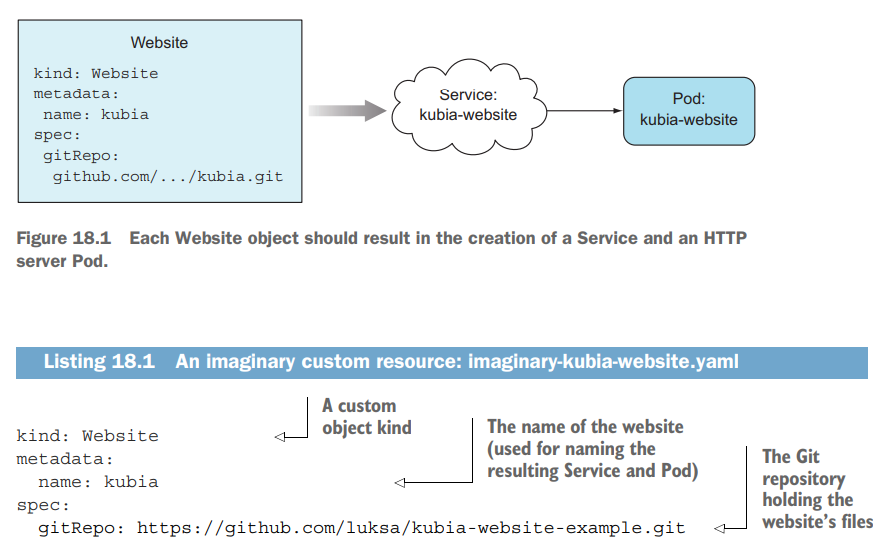

먼저 이놈을 정의해주는 crd를 생성하여야 한다.
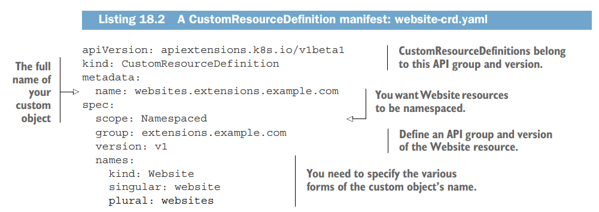

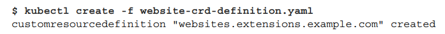

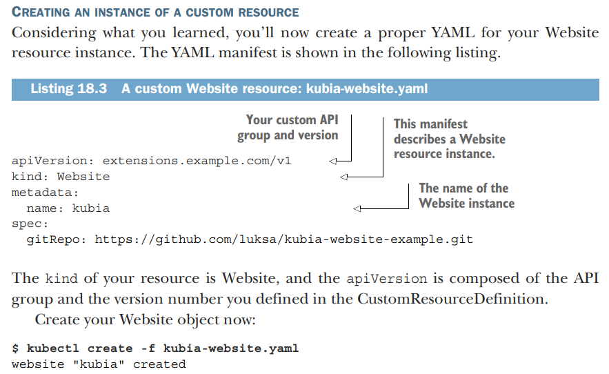

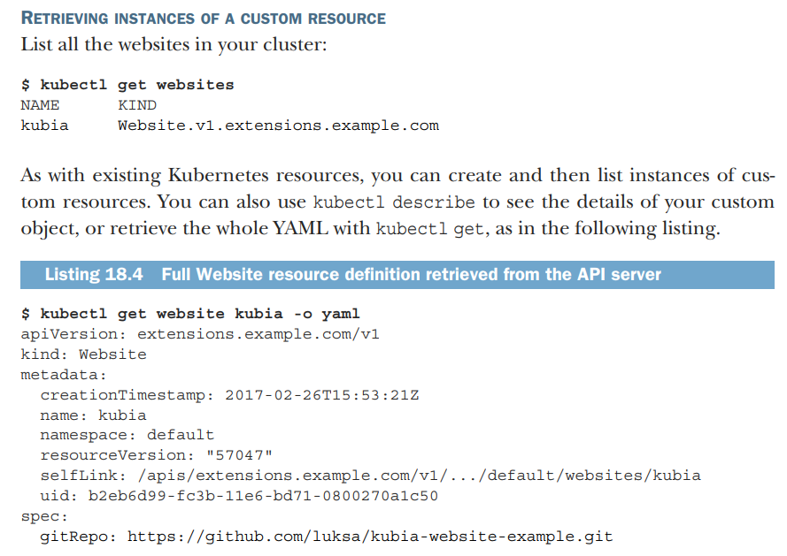

그러나 저게 딱 생성만 되고 아무 일도 안 일어날 거다.

내가 원하는 동작이 있으면 그에 맞는 custom controller가 필요하다.
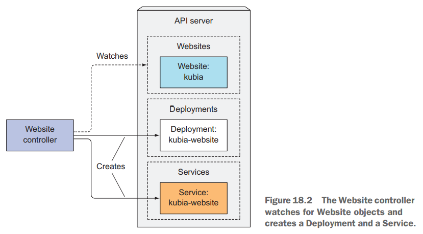

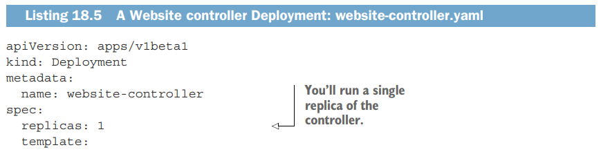

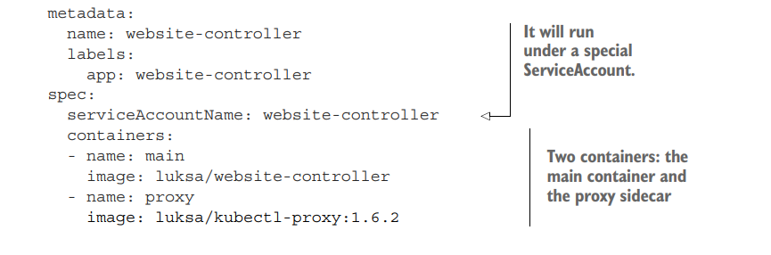

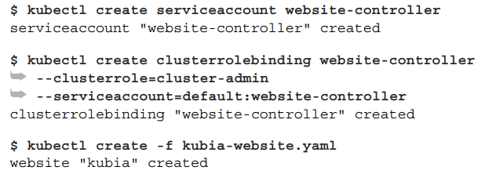

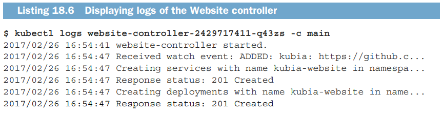

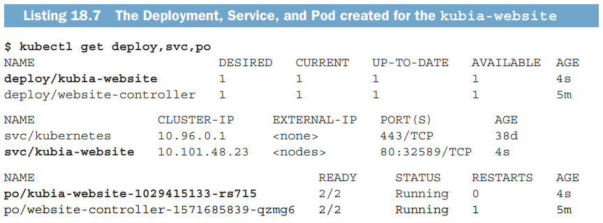

그러나 이렇게 controller를 만들어도 create 이전에 validation은 못해준다. (crd를 openAPI v3를 사용함으로 데이터타입이나 구문에 대한 것은 validation 가능)

API aggregation으로 custom API server를 둘 수도 있다.

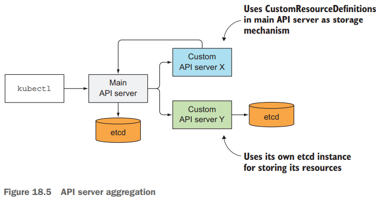

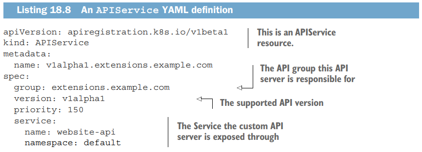

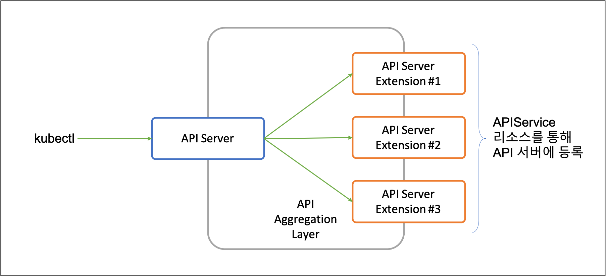
커스텀 리소스만을 사용할 것이라면 API Aggregation보다는 Operator를 통한 CRD를 사용하는 추세고, 다루기도 Operator가 더 쉽다.
API Aggregation 기능이 커스텀 리소스에만 사용되는 것이 아니기 때문에 API Server의 확장을 위해서는 여전히 필요할 수 있다.

CR 관리에 operator 개발하여 사용한다.
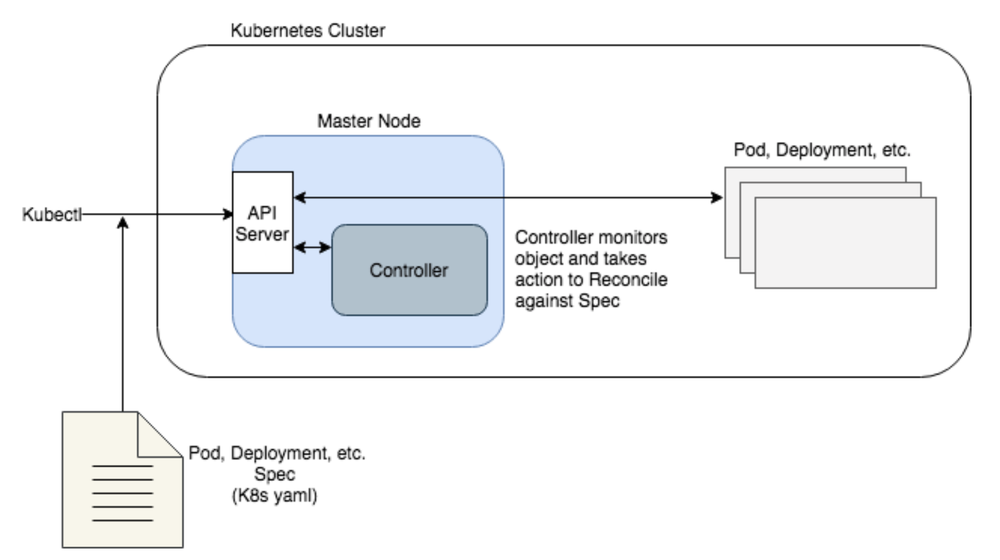

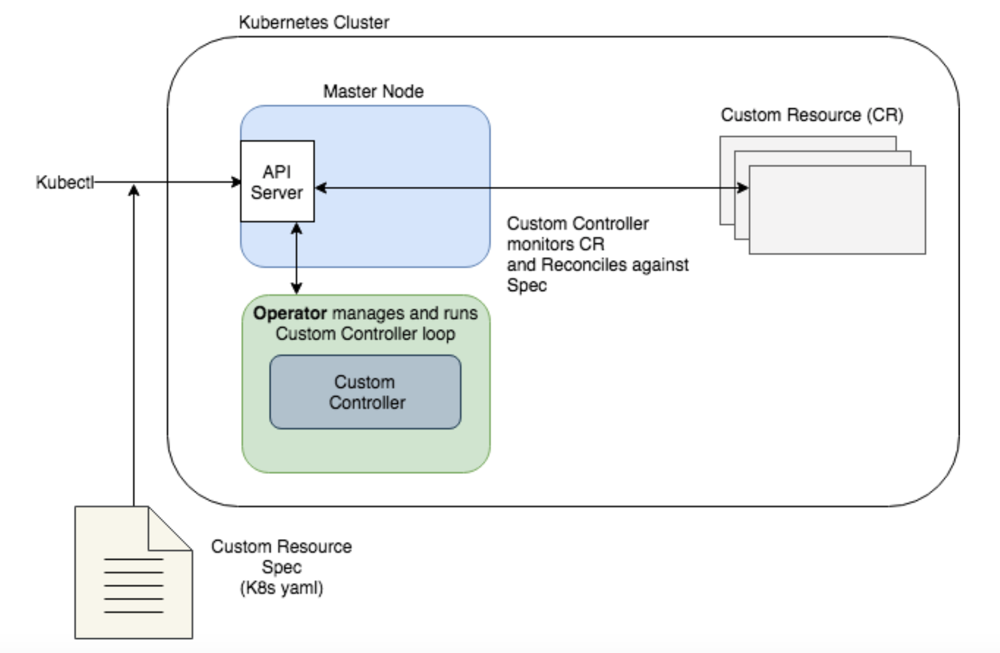

[Kubernetes 확장인 CRD와 CR 에 대한 개념 정리](https://ccambo.tistory.com/74)

[[Kubernetes - Operator] Kubernetes상의 Operator 나름대로 정리](https://ccambo.tistory.com/53)

operator-sdk를 통한 cr의 controller 구현 예시

[operator-sdk-samples/memcached_controller.go at master · operator-framework/operator-sdk-samples](https://github.com/operator-framework/operator-sdk-samples/blob/master/go/memcached-operator/controllers/memcached_controller.go)