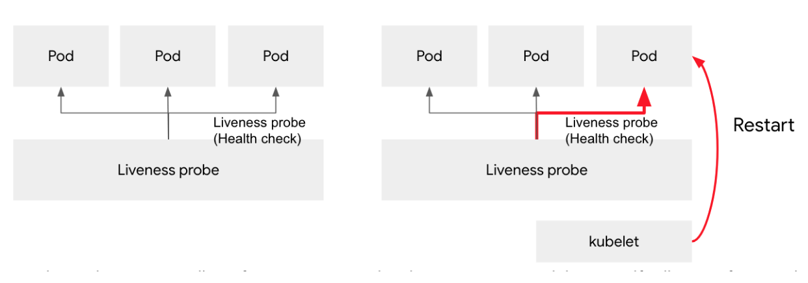
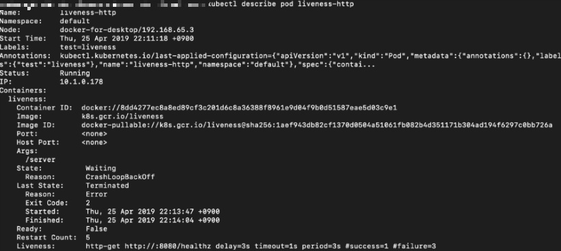
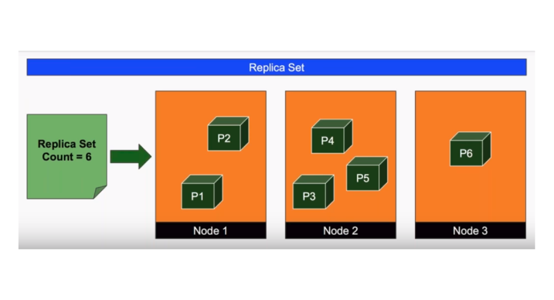
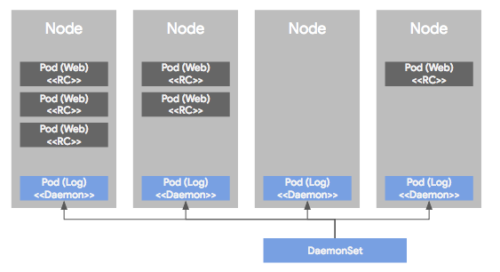
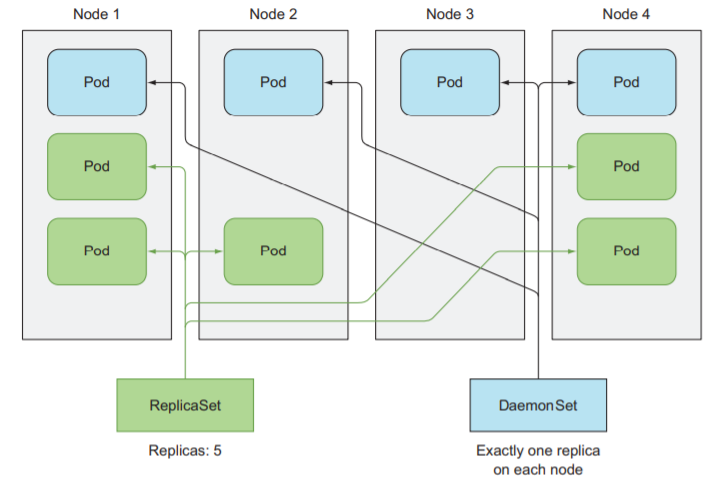
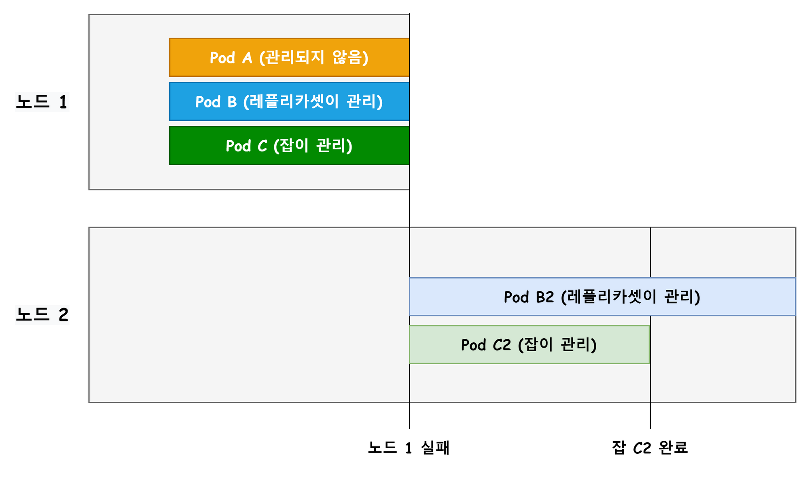
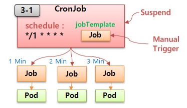

+++
author = "Jinsoo Youn"
title = "4장 - replicaset"
date = "2022-07-25"
description = "Liveness Probe & replicaset, daemonset, job"
tags = [
"kubernetes",
"study",
]
categories = [
"kubernetes",
"study",
]
series = ["Kubernetes-In-Action"]
aliases = ["Kubernetes-In-Action"]
image = "cover.png"
+++

Liveness probe 사용 방법과 파드를 관리하는 기본 리소스들을 알아보자
<!--more-->

컨테이너의 주 프로세스에 crash가 발생한다면 kubelet이 컨테이너를 다시 시작한다. 어플리케이션에 버그가 발생하면 쿠버네티스가 자동으로 다시 시작하기 때문에 어플리케이션 자체에 특별한 작업을 하지 않아도 쿠버네티스에서 실행 중인 어플리케이션을 자동으로 복구할 수 있다.

하지만 어플리케이션이 **무한 루프나 교착 상태에 빠져** 응답을 멈추는 상황에는 어떨까? Crash 같은 경우에는 프로세스가 강제로 종료되지만 무한루프나 교착 상태라면 아무도 알 수가 없다. 그래서 k8s에서는 라이브니스 프로브를 사용해 컨테이너가 살아있는 지 여부를 확인한다.

# Liveness Probe

> 라이브니스 프로브를 지정해 k8s가 더 이상 정상적이지 못한 경우 즉시 컨테이너를 재시작하게 할 수 있다.
>

라이브니스 프로브를 통해 컨테이너가 아직 살아있는지 확인할 수 있다. k8s는 주기적으로 검사를 실행하고 검사가 실패할 경우 컨테이너를 다시 시작한다.

컨테이너 진단은 컨테이너가 구현한 핸들러를 kubelet이 호출해서 실행한다.



> 운영 환경에서 실행 중인 파드의 경우, 항상 라이브니스 프로브를 정의해야 한다. 정의되어 있지 않으면 k8s는 어플리케이션이 아직 살아 있는지 여부를 알 수 없다.
>

k8에는 3가지 방법의 라이브니스 프로브가 있다.

## HTTP Request

HTTP GET 프로브는 지정한 IP 주소, 포트, 경로에 HTTP GET 요청을 수행한다. 응답이 오류를 나타내면 프로브는 실패로 간주하고 컨테이너를 재시작한다.

```yaml
apiVersion: v1
kind: Pod
metadata:
  labels:
    test: liveness
  name: liveness-http
spec:
  containers:
  - name: liveness
    image: k8s.gcr.io/liveness
    args:
    - /server
    livenessProbe:
      httpGet:  # HTTP Get을 수행할 라이브니스 프로브
        path: /healthz # 네트워크 포트 HTTP 요청에서 요청할 경로
        port: 8080 # 프로브가 연결해야 하는 네트워크 포트
        httpHeaders:
        - name: Custom-Header
          value: Awesome
      initialDelaySeconds: 3 # 컨테이너가 시작하고 3초 후 프로브 시작
      periodSeconds: 3 # 3초마다 프로브 실행
```

정의된 프로브는 k8s에게 컨테이너가 여전히 정상적으로 동작하는지 체크하기 위해 '/healthz' 경로의 포트 8080 HTTP GET 요청을 주기적으로 수행하도록 알려준다. 컨테이너 내에서 실행 중인 웹서버가 HTTP 요청에 응답하지 않으면 컨테이너를 다시 시작한다.

**동작 중인 라이브니스 프로브 보기**

`kubectl describe` 커맨드를 이용해 라이브니스 프로브를 확인할 수 있다.



`State`를 통해 컨테이너의 상태를 확인할 수 있으며 `Last State`는 지난 컨테이너의 상태를 확인할 수 있다. 지난 컨테이너가 있는 이유는 컨테이너가 문제가 생겨 강제 종료하고 다시 생성했기 때문이다.

또한 `Liveness`를 통해 라이브니스 프로브의 정보를 확인할 수 있다. 컨테이너가 실행되고 3초(delay) 이후 프로브를 시작하며 요청시 1초(timeout) 이내에 응답을 해야 한다. 그렇지 않으면 실패한다. 3초 마다(period) HTTP GET 요청을 하며 연속으로 3번 실패(failure)하면 kubelet이 해당 컨테이너를 재시작시킨다.

## TCP Socket

컨테이너의 지정된 포트에 TCP를 연결하려고 시도한다. 성공적으로 연결되면 프로브가 성공한 것이고, 그렇지 않으면 컨테이너가 재시작한다.

```yaml
apiVersion: v1
kind: Pod
metadata:
  name: goproxy
  labels:
    app: goproxy
spec:
  containers:
  - name: goproxy
    image: k8s.gcr.io/goproxy:0.1
    ports:
    - containerPort: 8080
    livenessProbe:
      tcpSocket:
        port: 8080
      initialDelaySeconds: 15
      periodSeconds: 20

```

TCP Socket을 통한 프로브는 HTTP Request 프로브와 비슷하다.

## Exec Command

컨테이너 내부에 임의의 명령을 실행하고 명령의 종료 상태 코드를 확인한다. 상태 코드가 0이면 검사가 성공한 것이고, 다른 모든 코드는 오류로 간주된다.

```yaml
apiVersion: v1
kind: Pod
metadata:
  labels:
    test: liveness
  name: liveness-exec
spec:
  containers:
  - name: liveness
    image: k8s.gcr.io/busybox
    args:
    - /bin/sh
    - -c
    - touch /tmp/healthy; sleep 30; rm -f /tmp/healthy; sleep 600
    livenessProbe:
      exec:
        command:
        - cat
        - /tmp/healthy
      initialDelaySeconds: 5
      periodSeconds: 5

```

kubelet이 initialDelaySeconds, periodSeconds를 고려해 `cat /tmp/healthy` 명령어를 수행한다. 컨테이너의 `args`를 보면 내부적으로 해당 빈 파일을 만들고 삭제하기 때문에 만일 삭제가 되면 라이브니스 프로브는 실패를 의미한다. kubelet은 지속적으로 커맨드를 보내는데 파일이 없으면 컨테이너가 비정상적이라는 것으로 판단한다.

**References**

- [책 | Kubernetes in Action 4장](http://www.yes24.com/Product/Goods/89607047)
- [Kubernetes | Configure Liveness, Readiness and Startup Probes](https://kubernetes.io/docs/tasks/configure-pod-container/configure-liveness-readiness-startup-probes/)
- [timewizhan | Liveness & Readiness Probe](https://timewizhan.tistory.com/entry/Kubernetes-Liveness-Readiness-Probe)

---

**컨트롤러**는 파드들을 관리하는 역할을 한다. 컨트롤러에는 ReplicaSet, DeamonSet,  Job, CronJob, Deployment, StatefulSet 등이 있다

# ReplicaSet

> 파드를 단독으로 만들면 파드에 문제가 생겼을 때 자동으로 복구되지 않는다. 이러한 파드를 정해진 수만큼 복제하고 관리하는 것이 레플리카셋이다. 레플리카셋은 원하는 개수의 파드를 유지한다.
>



일반적으로 레플리카셋을 직접 생성하지는 않는다. 그 대신 상위 수준의 디플로이먼트 리소스를 만들 때 자동으로 생성한다.

**🧩 레플리카셋 작성**

```yaml
# frontend.yaml
apiVersion: apps/v1
kind: ReplicaSet
metadata:
  name: frontend
  labels:
    app: guestbook
    tier: frontend
spec:
  replicas: 3 # 원하는 파드 개수. 기본값은 1
  selector: # 라벨 체크 조건. 어떤 레이블의 파드를 선택해서 관리할지 설정
    matchLabels:
      tier: frontend
  template: # 생성할 파드 명세
    metadata:
      labels:
        tier: frontend
    spec:
      containers: # 컨테이너 명세
      - name: php-redis
        image: gcr.io/google_samples/gb-frontend:v3

```

라벨을 체크해서 원하는 수의 파드가 없으면 새로운 파드를 생성한다.

**🧩 레플리카셋 생성**
이 매니페스트를 frontend.yaml에 저장하고 쿠버네티스 클러스터에 적용하면 정의되어 있는 레플리카셋이 생성되고 레플리카셋이 관리하는 파드가 생성된다.

```
# 레플리카셋 생성
$ kubectl apply -f frontend.yaml
```

**🧩 레플리카셋 확인**
현재 배포된 레플리카셋을 확인할 수 있으며 생성된 frontend를 볼 수 있다.

```
# 리소스 확인
$ kubectl get rs

NAME       DESIRED   CURRENT   READY   AGE
frontend   3         3         3       6s
```

- `DISIRED` : 레플리카셋 설정에 지정한 파드 개수
- `CURRENT` : 레플리카셋을 이용해 현재 클러스터에서 동작하는 실제 파드 개수
- `READY` : 사용할 준비가 완료된 파드의 개수

또한 레플리카셋의 상태를 확인할 수 있다. 출력은 다음과 유사할 것이다.

```
$ kubectl describe rs/frontend
```

```
Name:         frontend
Namespace:    default
Selector:     tier=frontend
Labels:       app=guestbook
              tier=frontend
Annotations:  kubectl.kubernetes.io/last-applied-configuration:
                {"apiVersion":"apps/v1","kind":"ReplicaSet","metadata":{"annotations":{},"labels":{"app":"guestbook","tier":"frontend"},"name":"frontend",...
Replicas:     3 current / 3 desired
Pods Status:  3 Running / 0 Waiting / 0 Succeeded / 0 Failed
Pod Template:
  Labels:  tier=frontend
  Containers:
   php-redis:
    Image:        gcr.io/google_samples/gb-frontend:v3
    Port:         <none>
    Host Port:    <none>
    Environment:  <none>
    Mounts:       <none>
  Volumes:        <none>
Events:
  Type    Reason            Age   From                   Message
  ----    ------            ----  ----                   -------
  Normal  SuccessfulCreate  117s  replicaset-controller  Created pod: frontend-wtsmm
  Normal  SuccessfulCreate  116s  replicaset-controller  Created pod: frontend-b2zdv
  Normal  SuccessfulCreate  116s  replicaset-controller  Created pod: frontend-vcmts

```

**🧩 파드 확인**
현재 파드 정보를 확인한다.

```
# 파드 확인
$ kubectl get pods

NAME             READY   STATUS    RESTARTS   AGE
frontend-b2zdv   1/1     Running   0          6m36s
frontend-vcmts   1/1     Running   0          6m36s
frontend-wtsmm   1/1     Running   0          6m36s
```

`.spec.replicas`를 3으로 설정했기 때문에 frontend-b2zdv, frontend-vcmts, frontend-wtsmm라는 파드가 실행되는 것을 확인할 수 있다.

**🧩 레플리카셋 삭제**
레플리카셋을 삭제한다. 레플리카셋을 삭제하면 관련 파드도 모두 삭제된다.

```
$ kubectl delete rs frontend
```

**References**

- [책 | Kubernetes in Action 4장](http://www.yes24.com/Product/Goods/89607047)
- [Kubernetes | 레플리카셋](https://kubernetes.io/ko/docs/concepts/workloads/controllers/replicaset/)

---

# DaemonSet

> 데몬셋은 클러스터 전체 노드에 특정 파드를 실행할 때 사용하는 컨트롤러다. 클러스터 안에 새롭게 노드가 추가되었을 때 데몬셋이 자동으로 해당 노드에 파드를 실행시킨다.
>

**🔎 컨트롤러**: 기본 오브젝트를 생성하고 이를 관리하는 역할로, 대표적으로 ReplicaSet, DeamonSet, StatefulSet, Job, Deployment 등이 있다.



데몬셋은 노드가 있는 수만큼 파드를 생성하고 각 노드에 파드를 하나씩 배포한다. 노드가 다운돼도 데몬셋은 어느 곳에서도 파드를 생성하지 않는다. 즉, 노드가 클러스터에서 빠졌을 때는 해당 노드에 있던 파드는 그대로 사라질 뿐 다른 곳으로 옮겨가서 실행되거나 하지 않는다.

모든 노드에 파드를 하나씩 배포하지 않아도 된다. 테인트와 톨러레이션 옵션을 사용하면 데몬셋을 전체 클러스터의 노드가 아니라 특정 노드들에만 선택해서 실행할 수도 있다.

> 데몬셋은 보통 로그 수집기를 실행하거나 노드를 모니터링하는 데몬 등 클러스터 전체에 항상 실행해두어야 하는 파드에 사용한다.
>

## 데몬셋 생성

```yaml
apiVersion: apps/v1
kind: DaemonSet
metadata:
  name: myapp-ds
spec:
  selector:
    matchLabels:
      app: myapp-ds
  template:
    metadata:
      labels:
        app: myapp-ds
    spec:
      nodeSelector:
        node: development
      containers:
      - name: myapp
        image: ghcr.io/c1t1d0s7/go-myweb
        ports:
        - containerPort: 8080
```

🔎 **.spec.template.spec.nodeSelector**: 파드를 특정 노드에 배치한다. 노드의 라벨 셀렉터 필드는 레플리카셋, 데몬잡, 잡, 디플로이먼트 컨트롤러에서도 사용할 수 있다.

## 데몬셋 확인

```
# 데몬셋 확인
$ kubectl get ds
```

```
$ kubectl get po
No resources found.
```

DISIRED, CURRENT, READY 등이 모두 0으로 보인다. 파드 목록을 나열하는 커맨드를 입력해도 마찬가지다. 파드가 생성되지 않는다. 왜 그럴까?

데몬셋 정의에 노드셀렉터로 `node=development` 레이블을 선택하도록 정의하였기 때문에 노드 레이블과 매칭되는 노드가 없어서 파드를 생성하지 않는다.

## 노드 레이블 지정

데몬셋이 파드를 생성하기 위해 노드에 레이블을 추가한다. kube-node1 노드에 node=development 노드 레이블을 설정한다.

```
$ kubectl label nodes kube-node1 node=development
node/kube-node1 labeled
```

## DaemonSet vs ReplicaSet

`레플리카셋`은 매니페스트 파일에 정의된 파드의 수가 클러스터에서 항상 실행되도록 하지만 `데몬셋`은 매니페스트에 정의된 하나의 파드 복사본이 모든 노드에 하나씩 실행되도록 한다.

레플리카셋은 클러스터에 원하는 수의 파드 복제본이 있는지 확인하는 반면, 데몬셋에는 원하는 레플리카 수의 개념이 없다. 파드 셀렉터와 일치하는 파드가 각 노드에서 실행 중인지 확인하는 것 자체가 데몬셋이 수행해야할 역할이다.



> 즉, 레플리카셋은 파드를 임의의 클러스터 노드로 스케줄하는 반면, 데몬셋은 모든 노드에 데몬셋에서 정의한 파드의 단일 인스턴스를 실행한다.
>

**References**

- [책 | Kubernetes in Action 4장](http://www.yes24.com/Product/Goods/89607047)
- [Kubernetes | 데몬셋](https://kubernetes.io/ko/docs/concepts/workloads/controllers/daemonset/)
- [kimjingo | 데몬셋](https://kimjingo.tistory.com/134)
- [nearhome | 데몬셋이란](https://nearhome.tistory.com/91)

---

`레플리카셋`과 `데몬셋`은 작업의 완료를 고려하지 않고 계속 테스크를 실행한다. 이런 파드의 프로세스는 종료되면 다시 시작된다. 그러나 완료 가능한 태스크에서는 프로세스가 종료된 후 다시 시작하면 안된다.

# Job


**🔎 컨트롤러**: 기본 오브젝트를 생성하고 이를 관리하는 역할로, 대표적으로 ReplicaSet, DeamonSet, StatefulSet, Job, Deployment 등이 있다.

> 잡은 하나 이상의 파드를 지정하고 지정된 수의 파드를 성공적으로 실행하고 종료하도록 한다. 즉, 내부에서 실행중인 프로세스가 성공적으로 완료되면 컨테이너가 다시 시작되지 않도록 하는 파드를 실행할 수 있다.
>

백업이나 특정 배치 파일들처럼 **한번 실행하고 종료되는 성격의 작업에 사용**될 수 있다.

노드 장애가 발생하면 잡이 관리하는 해당 노드의 파드는 레플리카셋의 파드와 같은 방식으로 다른 노드로 재스케줄된다. 잡은 프로세스 자체에 오류가 발생한 경우 컨테이너를 다시 시작하도록 구성할 수 있다.



## 리소스 정의

```yaml
apiVersion: batch/v1 # 잡은 batch api 그룹의 버전 v1에 있다
kind: Job
metadata:
  name: pi
spec:
  template:
    spec:
      containers:
      - name: pi
        image: perl
        command: ["perl",  "-Mbignum=bpi", "-wle", "print bpi(2000)"]
      restartPolicy: Never # 파드의 재시작 정책 설정
  backoffLimit: 4 # 재시도 횟수 설정
  activeDeadlineSeconds: 100 # 파드의 실행시간 설정
```

파이(π)의 2000자리까지 계산해서 출력한다.

**🔎 restartPolicy 옵션**: 파드의 재시작 정책을 설정한다.

- always: 항상 재시작한다. 기본값이지만, 잡 파드는 무제한 실행하지 않기 때문에 기본 정책을 사용할 수 없다. (사용할 경우에 에러가 발생한다.) restartPolicy 정책을 onFailure나 Never로 명시해야 한다.
- onFailure: 비정상 종료 발생 시 컨테이너를 재시작한다.
- Never: 재시작하지 않는다.

**🔎 backoffLimit 옵션**: 잡에 실패할 경우 다시 실행시킬 재시도 횟수를 지정한다. 기본값은 6이다. 보통 잡 컨트롤러가 재시작을 관리할 떄마다 시간 간격을 늘린다. 처음 재시작 실패후 10초를 기다린 후 시도하고 그 다음은 20초, 40초 이런 방식으로 계속 재시작 대기 시간을 늘린다.

**🔎 activeDeadlineSeconds 옵션**: 파드의 실행 시간을 지정한다. 파드가 이보다 오래 실행되면 시스템은 파드를 종료하려고 시도하고 잡을 실패한 것으로 표시한다.

## 리소스 생성

```
$ kubectl apply -f job.yaml
```

## 리소스 확인

```
$ kubectl describe jobs/pi
Name:           pi
Namespace:      default
Selector:       controller-uid=c9948307-e56d-4b5d-8302-ae2d7b7da67c
Labels:         controller-uid=c9948307-e56d-4b5d-8302-ae2d7b7da67c
                job-name=pi
Annotations:    kubectl.kubernetes.io/last-applied-configuration:
                  {"apiVersion":"batch/v1","kind":"Job","metadata":{"annotations":{},"name":"pi","namespace":"default"},"spec":{"backoffLimit":4,"template":...
Parallelism:    1
Completions:    1
Start Time:     Mon, 02 Dec 2019 15:20:11 +0200
Completed At:   Mon, 02 Dec 2019 15:21:16 +0200
Duration:       65s
Pods Statuses:  0 Running / 1 Succeeded / 0 Failed
Pod Template:
  Labels:  controller-uid=c9948307-e56d-4b5d-8302-ae2d7b7da67c
           job-name=pi
  Containers:
   pi:
    Image:      perl
    Port:       <none>
    Host Port:  <none>
    Command:
      perl
      -Mbignum=bpi
      -wle
      print bpi(2000)
    Environment:  <none>
    Mounts:       <none>
  Volumes:        <none>
Events:
  Type    Reason            Age   From            Message
  ----    ------            ----  ----            -------
  Normal  SuccessfulCreate  14m   job-controller  Created pod: pi-5rwd7
```

위와 같이 `Start Time`, `Completed At`, `Duration`, `Pod Statuses` 항목을 보면 65초 동안 파드를 성공적으로 실행하고 정상적으로 종료했다는 것을 확인할 수 있다.

```
# 원주욜 계산 결과 확인
$ kubectl logs pi-5rwd7

3.14159265358979323846264338327950288419716939937510582097494459230781640628620...
```

## 다수의 파드 실행

잡은 두 개 이상의 파드 인스턴스를 만들고 **병렬 또는 순차적으로 실행**하도록 구성할 수 있다. 잡 스펙의 `completions`와 `parallelism` 속성을 설정해 수행한다.

### .spec.completions

정상적으로 **실행 종료되어야 하는 파드 개수**를 정의한다. 기본값은 1이다.

```yaml
apiVersion: batch/v1
kind: Job
metadata:
  name: myjob
spec:
  completions: 5 # 실행 종료되어야 하는 파드 수 설정
  template:
    spec:
      ...
```

이 잡은 다섯 개의 파드를 차례대로 실행한다. 처음에는 하나의 파드를 만들고 파드 컨테이너가 완료되면 두 번째 파드를 만들고 다섯 개의 파드가 성공적으로 완료될 때까지 계속한다. 파드 중 하나가 실패하면 잡이 새 파드를 생성하기 때문에 전체적으로 보면 다섯 개 이상의 파드를 생성할 수 있다.

### .spec.parallelism

**동시에 몇 개의 파드가 실행**되어도 괜찮은지를 정의한다. 기본값은 1이고 0으로 설정하면 잡을 정지할 수 있다.

```yaml
apiVersion: batch/v1
kind: Job
metadata:
  name: myjob
spec:
  completions: 5
  parallelism: 2 # 잡 병렬성 관리
  template:
    spec:
      ...
```

이 잡은 2개의 파드를 만들어 **병렬로 실행**하며 5개의 파드를 성공적으로 완료해야 한다. 그 중 하나가 끝나면 잡은 다섯 개의 파드가 성공적으로 끝날 때까지 다음 파드를 실행한다.

## 잡 종료

잡이 정상적으로 실행 종료되면 파드가 새로 생성되지도 삭제되지도 않는다. 또한 잡도 남아 있다. 파드나 잡이 삭제되지 않고 남아 있으면 로그에서 에러나 경고를 확인할 수 있고 잡의 상태도 계속해서 확인할 수 있다.

`.spec.activeDeadlineSeconds` 필드에 시간을 설정하면, 지정된 시간에 해당 잡 실행을 강제로 끝내면서 모든 파드 실행도 종료한다.

**🧩 잡 삭제**

잡을 삭제하면 관련된 파드들도 같이 삭제된다.

```
$ kubectl delete job 잡이름
```

## 잡 패턴

잡의 일반적인 사용 패턴은 다음과 같다.

작업마다 잡을 하나씩 생성해 사용하는 것보다는 **모든 작업을 관리하는 잡 하나를 사용하는 것이 좋다.** 잡을 생성하는 오버헤드가 크기 때문에, 작업이 많아질수록 잡 하나가 여러개 작업을 처리하는 것이 좋다.

작업 개수만큼의 파드를 생성하는 것보다 **파드 하나가 여러 개의 작업을 처리하는 것이 좋다.** 파드를 생성하는 오버헤드도 크기 때문에 작업이 많아질수록 파드 하나가 여러 개 작업을 처리하는 것이 유리하다.

# CronJob



잡 리소스는 생성될 때 즉시 파드를 실행한다. 그러나 많은 배치 작업은 앞으로 **특정 시간에 실행되거나 지정된 간격으로 반복적인 실행**이 필요한 경우가 있다. 리눅스 같은 OS에서 이런 작업은 cron 작업으로 알려져있다. k8s도 이와 동일한 작업을 지원한다.

> 잡을 시간 기준으로 관리한다. 지정한 시간에 한번만 잡을 실행하거나, 지정한 시간동안 주기적으로 잡을 반복하는 작업에서 사용한다.
>

설정된 스케줄에 따라 크론잡에 구성된 잡 템플릿에 따라 잡 리소스를 생성한다. 잡 리소스가 생성되면 하나 이상의 파드 복제본이 생성되고 잡의 파드 템플릿에 따라 시작된다. 기본적으로 **CronJob은 Job과의 설정과 크게 다르지 않다. 다른 점은 스케줄로 주기를 설정하는 부분이다.**

## 리소스 정의

```yaml
apiVersion: batch/v1 # API 그룹은 batch이다.
kind: CronJob
metadata:
  name: hello
spec:
  schedule: "*/1 * * * *"   # 매 1분마다 실행
  jobTemplate:
    spec:
      template:
        spec:
          containers:
          - name: hello
            image: busybox:1.28
            imagePullPolicy: IfNotPresent
            command:
            - /bin/sh
            - -c
            - date; echo Hello from the Kubernetes cluster
          restartPolicy: OnFailure

```

매 1분마다 현재 시간과 hello 메시지를 출력한다.

### 크론 스케줄 문법

```
# ┌───────────── 분 (0 - 59)
# │ ┌───────────── 시 (0 - 23)
# │ │ ┌───────────── 일 (1 - 31)
# │ │ │ ┌───────────── 월 (1 - 12)
# │ │ │ │ ┌───────────── 요일 (0 - 6) (일요일부터 토요일까지;
# │ │ │ │ │                                   특정 시스템에서는 7도 일요일)
# │ │ │ │ │                                   또는 sun, mon, tue, wed, thu, fri, sat
# │ │ │ │ │
# * * * * *

> "2시간마다"라고 지정하고 싶으면, 간단히 */2를 사용하면 된다.

```

[스케줄 문법](https://www.notion.so/c6c0db5848694693b7f646f147245165)

어떤 이유로든 해당 스케줄 시간에 시작하지 않으면 작업이 실행되지 않고 실패로 표시된다.

## 리소스 확인

**🧩 크론 잡의 스케줄 설정 확인**

```
$ kubectl get cronjobs

NAME       SCHEDULE   		SUSPEND   ACTIVE   LAST SCHEDULE 	AGE
hello      */1 * * * *   	false     1	       11s       		15s
```

- `SUSPEND` : 크론잡이 정지되었는지 나타낸다.
- `ACTIVE` : 현재 실행중인 잡이 있는지를 나타낸다.
- `LAST SCHEDULE` : 마지막으로 잡을 실행한 후 어느정도 시간이 지났는지 나타낸다.

**🧩 크론 잡이 실행한 잡 확인**

```
$ kubectl get jobs
NAME               COMPLETIONS   DURATION   AGE
hello-4111706356   0/1                      0s
hello-4111706356   0/1           0s         0s
hello-4111706356   1/1           5s         5s
```

크론잡 이름이 hello 뒤에 숫자가 붙은 잡들이 실행된 것을 확인할 수 있다.

- `COMPLETIONS` : 작업이 성공적으로 완료한 횟수/총 작업 횟수
- `DURATION` : 작업을 성공적으로 완료하는 데 걸린 시간

## 리소스 삭제

```
$ kubectl delete cronjobs 크론잡이름
```

크론잡이 생성했던 잡과 파드까지 한꺼번에 삭제된다.

> 잡(Job)은 1회성 작업을 할 때 사용하며, 크론잡(CronJob)은 주기적인 배치 작업을 실행할 때 사용한다.
>

**References**

- [책 | Kubernetes in Action 4장](http://www.yes24.com/Product/Goods/89607047)
- [책 | 쿠버네티스 입문 - 6. 컨트롤러](http://www.yes24.com/Product/Goods/85578606)
- [Kubernetes | 잡](https://kubernetes.io/ko/docs/concepts/workloads/controllers/job/)
- [Kubernetes | 크론잡](https://kubernetes.io/ko/docs/concepts/workloads/controllers/cron-jobs/)