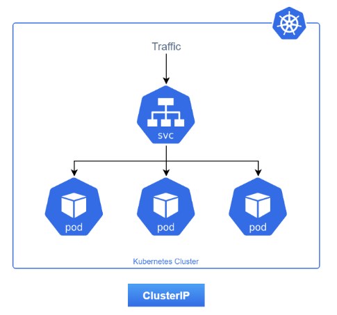
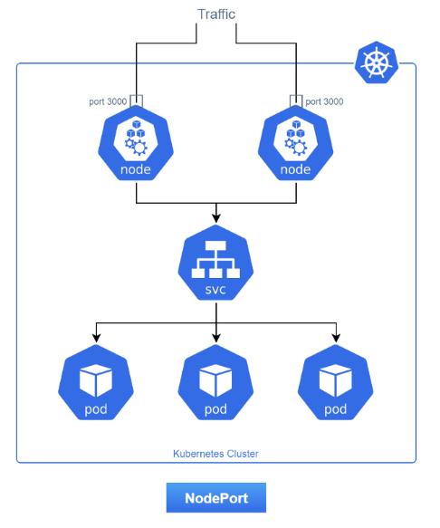
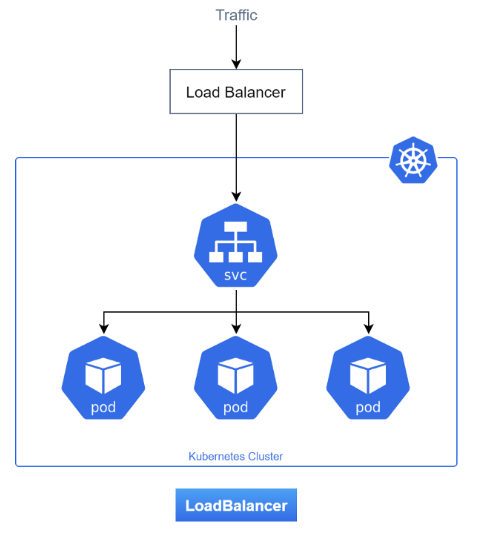
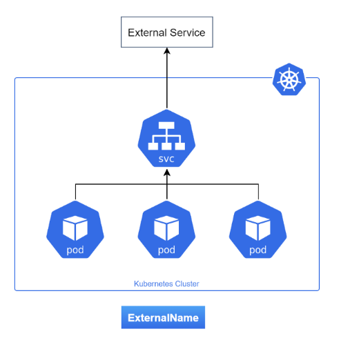
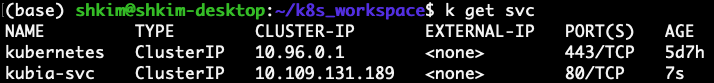
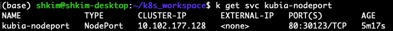
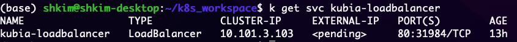
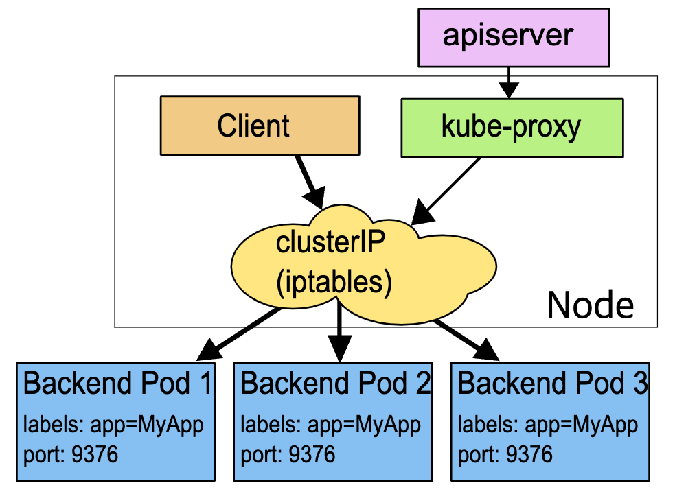
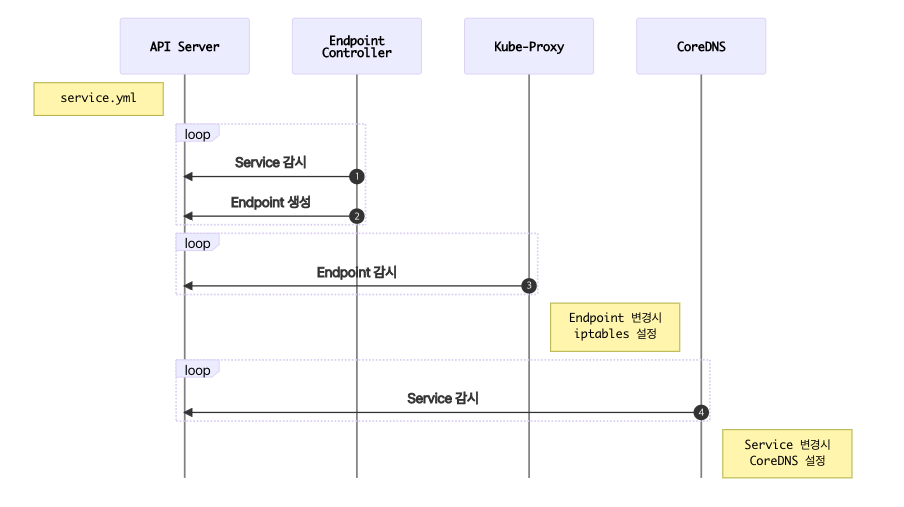

+++
author = "Jinsoo Youn"
title = "5장 - service"
date = "2022-07-27"
description = "쿠버네티스 서비스 타입과 파드 네트워킹 구조"
tags = [
"kubernetes",
"study",
]
categories = [
"kubernetes",
"study",
]
series = ["Kubernetes-In-Action"]
aliases = ["Kubernetes-In-Action"]
image = "cover.png"
+++


쿠버네티스의 서비스 타입와 파드간 통신하는 방법에 대해 알아보자
<!--more-->

- Pod가 다른 곳에서 제공하는 서비스를 사용하려면 다른 pod를 찾을 방법이 필요하다.
- 비쿠버네티스 세계는 서버의 정확한 IP주소나 호스트 이름을 지정하는 반면, 쿠버네티스는 그렇지 않다.
  - Pod는 일회성이다. Pod는 언제든지 제거되거나 다른 노드로 이동할 수 있다.
  - 쿠버네티스는 pod가 node로 스케줄된 후에 IP주소를 할당한다. 따라서 클라이언트는 서버 pod의 IP 주소를 미리 알 수 없다.
  - 수평 스케일은 여러 pod가 같은 서비스를 제공하는 것을 의미한다. 각 pod는 자체 IP 주소가 있다. 하지만, 같은 서비스를 제공하는 모든 pod는 단일 IP 주소를 통해 액세스할 수 있어야 한다.

# Service

- Service는 동일한 서비스를 제공하는 pod 그룹에 단일 진입 점을 만들기 위해 생성하는 리소스다.
- 각 service에는 service가 존재하는 동안에 절대로 변경되지 않는 IP 주소와 port가 있다.
- 클라이언트는 해당 IP 및 port에 연결할 수 있고, 이런 연결은 해당 service를 지원하는 pod 중 하나로 라우팅된다.
- 이제 pod의 개별 위치는 무관해지므로 언제든지 클러스터 내에서 이동할 수 있다.

- Service Type
  - ClusterIP

    Pod를 묶어주는 virtual IP 생성

    

  - NodePort

    외부에서 접속 가능하도록 모든 node의 특정 port를 open

    

  - LoadBalancer

    외부에 load balancer를 생성

    

  - ExternalName

    DNS처럼 외부 ip에 별칭 생성

    

**Service 예제**

- Service 생성

    ```yaml
    apiVersion: v1
    kind: Service
    metadata:
      name: kubia-svc
    spec:
      ports:
      - port: 80 # service가 사용할 port
        targetPort: 8080 # service가 forward할 port
      selector:
        app: kubia # label이 app=kubia인 모든 pod는 이 service에 속한다.
    ```

- Service 확인

    ```bash
    kubectl get svc
    ```

  

  - Service로 할당된 IP 주소가 10.109.131.189 이다.
  - 이 주소는 클러스터 안에서만 유효하다. (cluster-ip)
  - Service의 주 목적은 pod들의 그룹을 클러스터상의 pod에게 노출하는 것이다.

- 클러스터 안에서 Service 테스트
  - 몇 가지 방법을 통해 클러스터 내부의 Service에 요청을 전송할 수 있다.
    - 확실한 방법은 service의 cluster-ip 주소로 요청을 보내고 응답을 로그로 남기는 pod를 생성하는 것이다.
    - Kubernetes의 노드 중 하나로 ssh 접속을 수행하고 curl 명령을 사용할 수 있다.
    - kubectl exec 명령어를 통해 이미 존재하는 pod 중 하나에서 curl 명령을 수행할 수 있다.

  - 원격으로 실행중인 컨테이너에 명령어 실행

      ```bash
      kubectl exec kubia-g6wjn -- curl -s http://10.107.8.108
      ```

    kubia-g6wjn 컨테이너에서 curl을 통해 kubia-svc Service로 GET 요청.


- 동일한 service에서 여러 개의 port 노출

    ```yaml
    apiVersion: v1
    kind: Service
    metadata:
      name: kubia
    spec:
      ports:
      - name: http
        port: 80
        targetPort: 8080
      - name: https
        port: 443
        targetPort: 8443
      selector:
        app: kubia
    ```

- 이름이 지정된 port 사용
  - Pod 정의에 port 이름 설정하기

    spec:containers:ports 에 name과 containerPort 지정.

      ```yaml
      kind: Pod
      spec:
        containers:
        - name: kubia
          ports:
          - name: http
            containerPort: 8080
          - name: https
            containerPort: 8443
      ```

  - Service에 이름이 지정된 port 참조하기

      ```yaml
      apiVersion: v1
      kind: Service
      metadata:
        name: kubia
      spec:
        ports:
        - name: http
          port: 80
          targetPort: http
        - name: https
          port: 443
          targetPort: https
        selector:
          app: kubia
      ```

  - port의 이름을 지정하면, service 스펙의 변경 없이 port 번호를 변경할 수 있다.
  - Pod spec의 http port를 80으로 변경하기만 하면 된다.


**Service 검색**

- 쿠버네티스는 항상 클라이언트의 pod가 service의 IP와 port 번호를 알아낼 수 있는 방법을 제공한다.


- 환경 변수를 이용한 service 검색

  쿠버네티스는 pod가 시작되면 그 순간에 존재하는 모든 service를 가리키는 환경 변수 세트를 초기화한다. Pod를 생성하기 전에 service를 생성했다면 pod는 환경변수를 통해서 service의 IP 주소와 port 번호를 알 수 있다.

    ```bash
    kubectl exec kubia-8m72v -- env
    ```

  KUBIA_SVC_SERVICE_HOST, KUBIA_SVC_SERVICE_PORT 확인 가능.


- DNS를 이용한 서비스 검색
  - kube-system 네임스페이스에 kube-dns Pod가 있다. (coredns)
  - 이 Pod는 DNS서버를 실행하며, 클러스터에서 실행하는 다른 모든 pod가 자동으로 사용하도록 구성된다.
  - DNS서버에서 DNS항목을 가져오면, 클라이언트는 FQDN (Fully Qualified Domain Name)을 통해 service에 액세스할 수 있다.

- FQDN을 이용한 service 연결

    ```bash
    kubectl exec kubia-g6wjn -- curl -s http://kubia-svc.default.svc.cluster.local
    kubectl exec kubia-g6wjn -- curl -s http://kubia-svc.default
    kubectl exec kubia-g6wjn -- curl -s http://kubia-svc
    ```


# 클러스터 외부 서비스에 연결

- 클러스터 외부의 service에 연결할 필요가 있는 경우가 있다.
- 클러스터 내에 실행 중인 pod는 내부 service에 연결하는 것처럼 외부 service에 연결할 수 있다.

- Service endpoint 소개

  Service는 pod를 직접 연결하지 않고, endpoint라는 리소스가 pod와 service 사이에 위치한다.

    ```bash
    kubectl describe svc kubia-svc
    # or
    kubectl get endpoints kubia-svc
    ```


- 수동으로 service endpoint 설정
  - Pod 셀렉터 없이 service를 만들면, 쿠버네티스는 endpoint 리소스를 만들지 않는다.
  - Endpoint 리소스를 수동으로 만들고 업데이트할 수 있다.

  - 셀렉터 없이 서비스 생성

      ```yaml
      apiVersion: v1
      kind: Service
      metadata:
        name: kubia-external-svc
      spec:
        ports:
        - port: 80
          targetPort: 8080
      ```

  - Endpoint 리소스 생성

      ```yaml
      apiVersion: v1
      kind: Endpoints
      metadata:
        name: kubia-external-svc # Service 이름과 매칭돼야 한다.
      subsets:
        - addresses:
          - ip: 11.11.11.11
          - ip: 22.22.22.22 # Service가 연결을 포워딩할 enpoint의 ip들
          ports:
          - port: 80 # Endpoint의 대상 포트
      ```

  - pod → service → endpoint → (internet) 11.11.11.11:80

- 외부 서비스를 위한 별칭 생성 (ExternalName)
  - Endpoint를 수동으로 구성해 노출하는 대신 간단한 방법을 사용해 FQDN으로 외부 service를 참조할 수 있다.

  - ExternalName Service 생성

      ```yaml
      apiVersion: v1
      kind: Service
      metadata:
        name: external-service-externalname
      spec:
        type: ExternalName
        externalName: google.com # 실제 서비스의 FQDN
        ports:
        - port: 80
      ```

    - 서비스를 사용하는 pod로 부터 실제 서비스의 이름과 위치 (google.com)를 숨길 수 있고 실제 FQDN 대신  external-service-externalname 를 이용해 외부 서비스에 연결할 수 있다.

# 외부 클라이언트에서 내부 서비스 접근

- 지금까지는 클러스터 내부에서 pod가 서비스를 사용하는 방법을 알아봤다.
- 외부 클라이언트가 쿠버네티스 클러스터 내부 서비스에 접근할 수 있도록 하고 싶을 수도 있다.
- Service가 외부에서 액세스 가능할 수 있게 하는 방법
  - NodePort 타입의 Service 생성

    각 node에 port를 열고, port에서 발생한 트래픽을 service로 리다이렉트 한다.

  - LoadBalancer 타입의 Service 생성 (NodePort의 확장형)

    쿠버네티스가 실행 중인 클라우드 인프라스트럭처에 프로비전된 LoadBalancer를 통해 서비스 액세스를 할 수 있게 된다. (AWS, GCP 등에서 사용 가능)

  - Ingress 리소스 생성

    5.4 (생략)


- NodePort Service 사용
  - 모든 node를 대상으로 동일한 port 번호를 예약한다.
  - ClusterIP 타입과 비슷하지만, NodePort 타입은 내부 클러스터 IP를 통해 액세스도 되고, node의 IP와 예약한 port를 통해서도 액세스 된다.

  - NodePort Service 생성

      ```yaml
      apiVersion: v1
      kind: Service
      metadata:
        name: kubia-nodeport
      spec:
        type: NodePort
        ports:
        - port: 80 # Service의 내부 클러스터 IP의 포트
          targetPort: 8080 # 이 서비스를 지원하는 pod의 port
          nodePort: 30123 # 이 서비스는 각 클러스터 노드를 포트 30123을 통해 액세스할 것이다
        selector:
          app: kubia
      ```


    - NodePort Service 확인
        
        
        
        다음 주소를 통해 액세스 가능하다.
        
        - (cluster 내의 pod에서) 10.102.177.128:80
        - <노드의 IP>:30123

- LoadBalancer
  - NodePort는 node의 port를 열어 외부 트래픽이 직접 접근하여 보안적으로 좋지 않다.
  - NodePort 서비스의 확장으로 로드 밸런서의 IP 주소를 통해 서비스에 액세스할 수 있다.

      ```yaml
      apiVersion: v1
      kind: Service
      metadata:
        name: kubia-loadbalancer
      spec:
        type: LoadBalancer
        ports:
        - port: 80
          targetPort: 8080
        selector:
          app: kubia
      ```

    - nodePort를 지정해줄 수 있다. 지정하지 않으면 kubernetes가 임의의 port를 부여한다.

  - minikube에서 loadbalancer external ip 활성화

      ```bash
      minikube tunnel
      ```


    - LoadBalancer Service 확인
        
        
        
        다음의 주소로 접속 가능하다
        
        - (cluster 내의 pod에서) 10.101.3.103:80
        - <노드의 IP>:31984
        - <EXTERNAL-IP>:80

# Pod가 연결을 수락할 준비가 됐을 때 신호 보내기

- 새로운 pod의 라벨이 service의 pod selector와 일치하면 생성되자마자 service의 일부가 되고, 요청이 pod로 리다이렉트되기 시작한다.
- 하지만, pod가 요청을 처리할 준비가 돼 있지 않을 수 있다.
- 프로세스가 완전히 준비될 때까지 요청을 pod로 전달하지 않고 싶다.

- Readiness Probe 소개
  - 라이브니스 프로브와 유사
  - 세 가지 유형
    - Exec 프로브
    - HTTP GET 프로브
    - TCP 연결 프로브
  - 라이브니스 프로브와 달리, 컨테이너가 준비 확인에 실패한다면 종료되거나 다시 시작하지 않는다.
  - 레디니스 프로브가 실패한 pod는 서비스의 endpoint에서 삭제된다.
  - 레디니스 프로브는 클라이언트가 정상 상태인 pod하고만 통신하게 한다.

- Readiness Probe 추가

    ```bash
    kubectl edit replicaset.app kubia
    ```

    ```yaml
    template:
    	spec:
    		containers:
    			- image: luksa/kubia
    				name: kubia
    				readinessProbe:
    					exec:
    						command:
    						- ls
    						- /var/ready
    ```

  - 레디니스 프로브는 주기적으로 컨테이너 안에서 ls /var/ready 명령을 실행한다.
  - /var/ready 파일이 있으면 성공 0의 종료 코드를 반환하고, 없으면 0이 아닌 값을 반환해 실패이다.
  - 모든 pod를 삭제해서 변경된 readinessProbe가 적용된 pod를 새로 생성하면, READY가 0이다.
  - 각 컨테이너에 /var/ready 파일을 생성하기 전까지, endpoint에 포함되지 않는다.

  - 파일 생성 후 Ready 상태 및 endpoint 확인

      ```yaml
      kubectl exec kubia-gsjpz -- touch /var/ready
      ```


- Readiness Probe 항상 정의하기
  - Pod에 readiness probe를 추가하지 않았다면 거의 즉시 service endpoint가 될 것이다.

# Service의 구현 방식

- kube-proxy 소개
  - Service와 관련된 모든 것은 각 node에서 실행되는 kube-proxy 프로세스에 의해 처리된다.
  - kube-proxy는 userspace 프록시 모드에서 iptables 프록시 모드로 교체됐다.
  - Service의 주요 세부 사항은 IP와 port의 쌍으로 구성되므로 service IP 자체는 아무것도 나타내지 않는다.

- kube-proxy가 iptables를 사용하는 방식

  

  

  - Service를 만들면, 가상 IP 주소가 할당되고, endpoint controller가 Service와 Pod를 보면서 endpoint를 생성한다.
  - kube-proxy는 endpoint 객체의 변경 사항을 감시하면서 iptables를 구성한다.
  - kube-proxy는 iptables 규칙을 설정해 service IP/port 쌍을 대상으로하는 패킷을 가로채고 목적지 주소를 수정해 service를 지원하는 pod 중 하나에 리다이렉션하도록 한다.