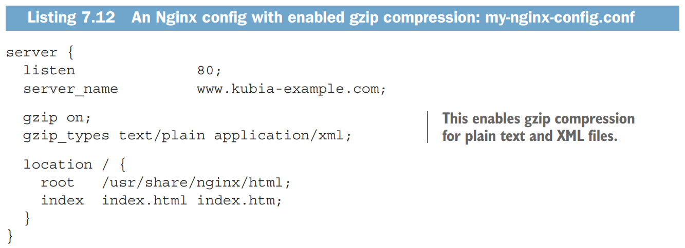
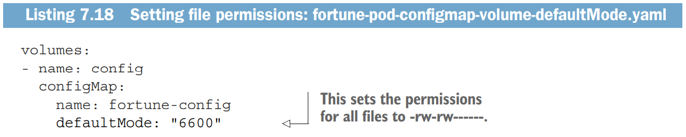
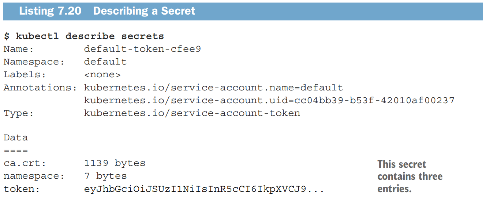

+++
author = "Jinsoo Youn"
title = "7장 - configMap & Secret"
date = "2022-07-29"
description = "쿠버네티스 서비스 타입과 파드 네트워킹 구조"
tags = [
"kubernetes",
"study",
]
categories = [
"kubernetes",
"study",
]
series = ["Kubernetes-In-Action"]
aliases = ["Kubernetes-In-Action"]
image = "cover.png"
+++

컨테이너에 설정 정보를 주입하는 방법을 알아보자. configMap, Secret
<!--more-->

# 어떻게 하면 컨테이너에게 설정 정보를 잘 주입할 수 있을까?

## 컨테이너 실행 시 argument를 주는 방법

- Docker Image에서 `ENTRYPOINT`와 `CMD`에 해당하는 것이 k8s Container 명세에서는 `command`와 `args`이다.
  command와 args를 사용하면 ENTRYPOINT와 CMD를 덮어쓰게 되는데, command를 덮어쓸 일은 잘 없고 args를 덮어쓸 일이 대부분이다.
  (busybox처럼 ENTRYPOINT가 아예 정의되지 않은 경우는 예외)


- 이때 yaml에서 array는 []로도 표기할 수 있고 -로도 표기할 수 있다. 즉 다음 둘은 동등하다.

```yaml
args: ["arg1", "arg2", "arg3"]

args:
- arg1
- arg2
- arg3

# 아래의 표기법을 사용하는 경우,
# arg1, arg2, arg3이 string인 경우 따옴표를 안 써도 된다.
# 단, 숫자는 따옴표로 감싸주어야 한다.
```

- The CMD instruction has three forms -
    - CMD ["only_executable","parameter_1","parameter_1"] (executable form)
        - 우리 console 이미지도 이 방식을 사용한다.
        - [https://github.com/tmax-cloud/console/blob/hc-dev-v5.1/Dockerfile](https://github.com/tmax-cloud/console/blob/hc-dev-v5.1/Dockerfile)
        - [https://github.com/tmax-cloud/install-console/blob/5.0/manifest/04_CONSOLE/base/001_deploy.yaml#L16](https://github.com/tmax-cloud/install-console/blob/5.0/manifest/04_CONSOLE/base/001_deploy.yaml#L16)
    - CMD ["parameter_1","parameter_2"] (used to provide default parameters to the ENTRYPOINT instruction)
    - CMD command param1 param2 (It is the shell form)

- The forms of the ENTRYPOINT Instruction are -
    - ENTRYPOINT ["only_executable", "parameter_1", "parameter_2"] (executable form)
    - ~~ENTRYPOINT command parameter_1 parameter_2 (Shell form)~~
        - ENTRYPOINT를 Shell form으로 사용하면 불필요한 프로세스가 생긴다. 쓰지 말자.
        - `ENTRYPOINT ["node", "app.js"]`

            ```bash
            $ docker exec 4675d ps x
            
             PID TTY STAT TIME COMMAND
            	 1 ?   Ssl  0:00 node app.js
            	12 ?   Rs   0:00 ps x
            ```

        - `ENTRYPOINT node app.js`

            ```bash
            $ docker exec -it e4bad ps x
            
             PID TTY STAT TIME COMMAND
               1 ?   Ss   0:00 /bin/sh -c node app.js
               7 ?   Sl   0:00 node app.js
              13 ?   Rs+  0:00 ps x
            ```


## 컨테이너에 ENV 설정을 주는 방법

- 주의 : pod가 아니라 컨테이너에게 설정해주는 것이다!

  


# 설정 정보만 따로 분리할 수는 없을까?

## ㅇㅇ 그러라고 ConfigMap이 있는 것이다.


환경 변수를 ConfigMap에서 가져오거나, ConfigMap을 volume으로 mount할 수 있다.

이제 설정 정보가 분리되었으니 다음과 같이 사용할 수 있게 된다.


## ConfigMap 만들기

### from-literal

```bash
$ kubectl create configmap fortune-config --from-literal=sleep-interval=25
configmap "fortune-config" created

# from-literal 여러 개를 사용하는 것도 가능
$ kubectl create configmap myconfigmap --from-literal=foo=bar --from-literal=bar=baz --from-literal=one=two
```


### from yaml

```bash
$ kubectl create -f fortune-config.yaml
```

### from file

```bash
$ kubectl create configmap my-config --from-file=config-file.conf
# 이러면 파일이름이 key, 파일내용이 value가 된다.
# 아래와 같이 key를 직접 지정할 수도 있다.
$ kubectl create configmap my-config --from-file=customkey=config-file.conf

# from-file 뒤에 디렉토리 하나를 통째로 줄 수도 있다.
$ kubectl create configmap my-config --from-file=/path/to/dir
# 이러면 해당 디렉토리 하위의 모든 파일에 대해 from-file을 해준 것과 같다.
# (key=파일이름, value=파일내용)이 여러 쌍 생성되어 configmap에 저장된다.
# 단, ConfigMap에서 key로 사용할 수 없는 이름을 가진 파일들은 이 과정에서 자동으로 배제된다.
```

### 섞어쓰기


## ConfigMap로 환경변수 설정하기

### env[i].valueFrom.configMapKeyRef


- pod 생성하려는데 ConfigMap이 없으면 어떡하나?
    - 존재하지 않는 ConfigMap을 참조하는 컨테이너는 생성되지 않는다.
    - 문제가 없는 다른 컨테이너들은 생성될 수 있다.
    - 나중에라도 ConfigMap이 생성되면 문제된 컨테이너가 만들어진다. (pod 재생성 필요없음)
    - `configMapKeyRef.optional: true` 같은 옵션을 준 경우 ConfigMap이 없어도 생성된다.

### 늘 한 땀 한 땀 가져와 설정해줘야 하나?

ㄴㄴ ConfigMap을 통째로 들고와서 설정할 수도 있음

### envFrom


이러면 ConfigMap의 key들 앞에 전부 CONFIG_가 붙은 채 환경변수로 생성된다. (optional)

이때, ConfigMap에 저장된 key-value 쌍 중에서 ENV key로 쓸 수 없는 것들(dash(`-`)를 포함한다든지 하는 것들)은 누락된다. 누락이 발생했다는 것은 알려준다.

### argument로 전달하기


위와 같이 ConfigMap을 이용해서 env를 설정한 다음, args에서 env를 참조하게 한다.

## 환경변수 말고는 설정 못함?

ㄴㄴ 설정파일(들)을 ConfigMap에 저장하고 컨테이너에 volume mount시켜 전달할 수도 있음

## ConfigMap을 volume으로 mount하기



이렇게 생긴 설정파일(들)을 포함하는 디렉토리가 있다고 하자.


위 디렉토리를 통째로 from-file에 넣어서 생성한 ConfigMap은 이렇게 생겼을 것이다.


이 ConfigMap을 이용해서 다음과 같이 설정하려면,


pod 명세는 이렇게 작성하면 된다.


volumes는 pod의 속성이고, volumeMounts는 container의 속성임에 유의하자.

그런데 이렇게 해놓으니 심기가 아주 불-편하다.

- web-server 컨테이너에서는 my-nginx-config.conf 만 사용하고 sleep-interval은 사용하지 않는데도 둘 다 마운트가 되어 있네?
- 그렇다고 컨테이너별로 사용할 ConfigMap을 따로따로 분리해서 생성, 마운트하자니… 같은 pod에 속한 컨테이너는 한 가지 목적을 가지고 묶어 놓은 건데 설정 파일을 찢어놓는 게 맞나?

이 불편한 심기는 좀 이따 해소해보도록 하고 일단 다음 설정을 보자.



이렇게 defaultMode 옵션으로 권한 설정을 해줄 수도 있다.

ConfigMap을 volume으로 mount할 때 유의할 점이 있는데,

Linux에서 non empty directory에 file system을 mount하면
기존의 내용물이 일시적으로(mount 해제 전까지) 접근불가능해지듯이,
컨테이너에서 volume mount할 때도 똑같다(기존 내용물이 숨겨진다)는 점에 유의하자.

중요한 디렉토리 혹은 root에 가까운 디렉토리에 volume을 mount 시킬 때는 특별히 주의하자.

## ConfigMap이 업데이트되면 마운트된 볼륨도 업데이트된다.

볼륨 내의 파일들에 대해서 순차적으로 진행되는 게 아니라, 볼륨 전체에 통째로 일어난다.

(사실은 볼륨 자체가 통째로 교체되는 것임)

1분 정도 시간이 걸릴 수 있음에 유의하자.

볼륨이 업데이트되는 과정을 살펴보자면 이렇다.


1. ConfigMap이 변경되면 새로운 디렉토리 `4984_09_어쩌구저쩌구` 이런 놈이 생성된다.
2. `..data`라는 symbolic link가 가리키던 디렉토리가 위의 새로운 디렉토리로 변경된다.
3. `..data` 안에 들어있던 파일들(사실은 symbolic link들)도 동시에 업데이트된다.

### ConfigMap에서 env 가져올 때처럼
volume으로 가져올 때도 일부만 떼어서 가져올 수는 없나?

ㅇㅇ 할 수 있고 이렇게 하면 된다.


근데 이렇게 설정되어 있으면 ConfigMap이 수정된다고 파일이 자동으로 업데이트되지 않는다 ㅜㅜ

파드 재생성 없이 파일에 대한 자동 업데이트가 꼭 필요하면,
임시로 디렉토리 하나 정해서 거기에다 volume을 통째로 mount시킨 다음,
‘내가 진짜 쓰려는 파일 경로’에 symbolic link를 생성하는 방법이 있겠다.
(이때 symbolic link를 이미지에서 생성해놓든 컨테이너 시작시 생성되게 하든 상관없다.)

### 기존 내용물을 숨기지 않고 그대로 두면서, 파일 하나만 딱 추가하는 방법


subPath에는 configMap의 내용물을, mountPath에는 mount 후 저장될 파일의 경로를 명시해준다.

## 사용 중인 ConfigMap을 수정해도 되는 게 맞나?

- 컨테이너가 ‘같은 이미지로 생성되면 다 똑같은 것, 변하지 않는 것(immutability), 그렇기에 running중인 놈과 새로 생성된 놈이 구별되지 않는 것’이라는 게 기본 사상 아님?
- 그럼 running 중인 컨테이너에서 참조하는 ConfigMap을 수정하는 자체가 좀 이상한 거 아님?

애플리케이션이 auto-reload를 지원하지 않는다면 이상한 거 맞다. 컨테이너가 생성되는 시점에 따라 config가 서로 달라서 안 맞을 수 있으니까. (설정이 불완전하게 분리되어 있는 셈)

애플리케이션이 auto-reload를 지원해서 동기화가 실시간으로 이루어진다면 문제 없다. (설정이 완전히 분리되어 있는 경우)

# 민감한 데이터는 ConfigMap 말고 Secret을 쓰자!

secret으로 생성된 것은 조회시 base64로 인코딩되어서 보이고, etcd에도 암호화되어 저장된다.

하지만 뭔가를 secret으로 만들었다고 해서 100% 안심할 수 없음에 유의하자.

etcd를 지켜야 하는 건 물론이고 apiserver도 지켜야 한다.
etcd에 암호화되어 저장된다 해도 api 통해 조회하고 base64 디코드 해버리면 그만임…

그러니까 사용자 권한 관리를 잘 하자.

사실 우리가 모르는 사이에도 항상 자동으로 생성되고 자동으로 사용되고 있는 secret이 있다.

아무 pod나 describe해보면 아래와 같은 내용을 볼 수 있을 것이다.

```bash
Volumes:
 default-token-cfee9:
 Type: Secret (a volume populated by a Secret)
 SecretName: default-token-cfee9
```

발견된 secret을 get해보자.

Volumes:
default-token-cfee9:
Type: Secret (a volume populated by a Secret)
SecretName: default-token-cfee9

```bash
$ kubectl get secrets

NAME                TYPE                                DATA AGE
default-token-cfee9 kubernetes.io/service-account-token 3    39d
```

이 secret을 describe해보면 아래와 같다.



ca.crt, namespace, token 이렇게 3개의 데이터를 저장하고 있는 secret이라는 것을 알 수 있다.

describe pod의 결과에는 다음과 같은 부분도 있는데, 여기에 mount 경로가 나온다.

```bash
Mounts:
 /var/run/secrets/kubernetes.io/serviceaccount from default-token-cfee9
```

해당 경로로 직접 가보면 아래와 같이 3개의 파일이 들어있는 것을 확인할 수 있다.

```bash
$ kubectl exec mypod ls /var/run/secrets/kubernetes.io/serviceaccount/
ca.crt
namespace
token
```


pod에 자동으로 secret account token이 mount되는 것을 막고 싶으면, pod 명세에서 `automountServiceAccountToken`옵션을 `false`로 주면 된다.

우리도 신한? 요건으로 이런 게 들어와서, 위 옵션이 적용된 배포환경이 있다.

[https://github.com/tmax-cloud/install-console/blob/5.0/manifest/04_CONSOLE/base/001_deploy.yaml#L16](https://github.com/tmax-cloud/install-console/blob/5.0/manifest/04_CONSOLE/base/001_deploy.yaml#L16)

(`automountServiceAccountToken: false`에 주목하고, 주석처리된 행 근처를 유의해서 보자.)

CK1 환경에서 직접 실행해서 조회해보자

```bash
kubectl get po console-55d989cf95-nvlsn -n api-gateway-system -o yaml
kubectl describe po console-55d989cf95-nvlsn -n api-gateway-system

kubectl get secret console-token-cj22k -n api-gateway-system -o yaml
kubectl describe secret console-token-cj22k -n api-gateway-system

kubectl get secret console-token-cj22k -n api-gateway-system -o jsonpath='{.data.token}' | base64 --decode
kubectl get secret console-token-cj22k -n api-gateway-system -o jsonpath='{.data.namespace}' | base64 --decode
kubectl get secret console-token-cj22k -n api-gateway-system -o jsonpath='{.data.ca.crt}' | base64 --decode
kubectl get secret console-token-cj22k -n api-gateway-system -o jsonpath='{.data.ca\.crt}' | base64 --decode
```

### Secret 만들기 - from file

```bash
$ kubectl create secret generic fortune-https --from-file=https.key --from-file=https.cert --from-file=foo
secret "fortune-https" created
```

ConfigMap과 별반 차이가 없지 않나?

### Secret vs ConfigMap


k8s에서는 Secret을 먼저 지원했고, 나중에 ConfigMap이 추가되었다.

앞서 언급하긴 했는데, Secret에 저장된 data는 base64 인코딩된 값으로 보여진다.

ConfigMap이 없고 Secret만 쓸 수 있는 경우, (민감하지 않은) YAML이나 JSON 데이터를 관리할 때 좀 더 고통스러울 것이다.

### Secret에는 binary data도 저장할 수 있다.

앞서 본 예시들은 string data이지만, binary data도 base64 인코딩이 가능하기 때문에 secret으로 저장할 수 있다. 이런 이유로, binary data는 민감하지 않은 것이더라도 secret을 사용하고 싶을 수 있다. 단 1MB를 넘을 수는 없다.

### Secret에 string data를 저장할 땐 stringData를 사용하자.


data에다 뭔가를 저장하고 싶으면 base64 인코딩을 미리 해서 넣어줘야 한다.

귀찮으면 stringData 필드에 작성해주자. 그러면 저장될 때 알아서 base64로 인코딩이 된다.
(stringData는 ‘쓰기 전용’이다.)

pod에서 secret을 사용하는 경우나 golang에서 client-go를 사용하는 경우, secret에서 data를 읽어올 때 우리가 따로 base64 디코딩을 신경쓰지 않아도 된다. 알아서 잘 알아먹는다.

## Secret 사용 예시

ConfigMap의 설정 정보에서 민감한 부분만 떼어내서 Secret으로 저장하고, 각각 mount해줄 수 있다.


위와 같이 nginx 설정파일이 작성되었다고 하자.

`https.cert`, `https.key`파일은 Secret으로 저장해두고 pod에서 ConfigMap과 Secret을 둘 다 mount하면 잘 동작할 것이다.


(Secret을 mount할 때도 ConfigMap을 mount할 때처럼 defaultMode로 권한설정을 할 수 있다.)

Secret volume에 저장되는 파일들은 in-memory filesystem (tmpfs) 을 사용한다.

```bash
$ kubectl exec fortune-https -c web-server -- mount | grep certs
tmpfs on /etc/nginx/certs type tmpfs (ro,relatime)
```

그래서 Secret 속의 데이터는 디스크에 써지지 않는다.

### Secret으로부터 Env 값 가져오기


configMapKeyRef 대신 secretKeyRef를 쓴다는 점만 다르고 아까 본 것과 똑같다.

다만 정말로 민감한 정보에 대해서는 이 방법을 사용해도 될지 생각해볼 필요가 있다.

가능하면 Secret Volume을 사용하고, 정말 필요할 때만 (최소 두 번은 생각해보고 나서) Secret을 Env로 가져와 사용하자.

### Image Pull Secret

```bash
$ kubectl create secret docker-registry mydockerhubsecret \
 --docker-username=myusername --docker-password=mypassword \ 
 --docker-email=my.email@provider.com
```


이렇게 설정해두면 pod가 private docker registry에서 image를 받아올 수 있다.

Image Pull Secret을 Service Account에 추가해두면, 모든 pod에 위와 같이 설정해주지 않아도 일괄 적용이 좀 더 용이하다. (12장)

### Secret Types

Secret을 생성하고 사용할 때 실제로 고려하게 될 일은 잘 없지만 그래도 한번 봐놓자.

image pull secret은 dockerconfigjson,

service account token secret은 service-account-token,

아무거나 저장하면 Opaque, 이런 식으로 자동으로 타입이 정해진다.

Secret yaml 조회 시에 볼 수 있다.


